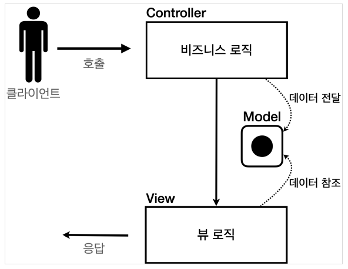
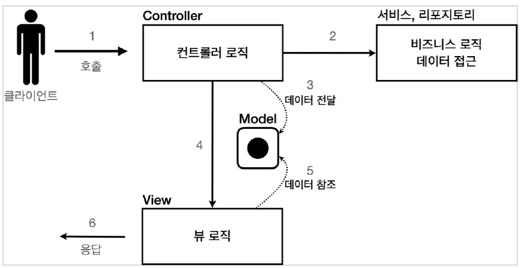

# 서블릿, JSP, MVC 패턴

---

## 서블릿, JSP, MVC 패턴 - 회원 관리 웹 애플리케이션 요구사항

회원 정보

이름:`username`
나이:`age`

**기능 요구사항**

+ 회원 저장
+ 회원 목록 조회

domain/member/Member

```java
@Getter
@Setter
public class Member {

    private Long id;
    private String username;
    private int age;

    public Member(){}

    public Member(String username, int age) {
        this.username = username;
        this.age = age;
    }
}
```


domain/member/MemberRepository

```java
public class MemberRepository {

    private static Map<Long,Member> store = new HashMap<>();
    private static long sequence = 0L;

    //싱글톤
    private static final MemberRepository instance = new MemberRepository();

    private MemberRepository(){} //아무나 생성하지 못하게 private

    public static MemberRepository getInstance() {
        return instance;
    }

    public Member save(Member member){
        member.setId(++sequence);
        store.put(member.getId(),member);
        return member;
    }

    public Member findById(Long id){
        return store.get(id);
    }

    public List<Member> findAll(){
        return new ArrayList<>(store.values());
    }

    public void clearStore(){
        store.clear();
    }
}
```

회원 저장소 테스트 코드

```java
public class MemberRepositoryTest {

    MemberRepository memberRepository = MemberRepository.getInstance();

    @AfterEach
    void afterEach(){
        memberRepository.clearStore();
    }

    @Test
    void save(){
        //given
        Member member = new Member("hello", 20);
        //when
        Member savedMember = memberRepository.save(member);
        //then
        Member findMember = memberRepository.findById(savedMember.getId());

        assertThat(findMember).isEqualTo(savedMember);
    }

    @Test
    void findAll(){
        //given
        Member member1 = new Member("member1", 20);
        Member member2 = new Member("member2", 30);

        memberRepository.save(member1);
        memberRepository.save(member2);

        //when
        List<Member> result = memberRepository.findAll();

        //then
        assertThat(result.size()).isEqualTo(2);
        assertThat(result).contains(member1,member2);

    }
}
```

---

### 서블릿으로 회원 관리 웹 애플리케이션 만들기

순수한 서블릿으로 만들어보기

---

web/servlet/MemberFormServlet

```java
@WebServlet(name = "memberFormServlet", urlPatterns = "/servlet/members/new-form")
public class MemberFormServlet extends HttpServlet {

    private MemberRepository memberRepository = MemberRepository.getInstance();

    @Override
    protected void service(HttpServletRequest request, HttpServletResponse response) throws ServletException, IOException {

        response.setContentType("text/html");
        response.setCharacterEncoding("utf-8");

        PrintWriter w = response.getWriter();
        w.write("<!DOCTYPE html>\n" +
                "<html>\n" +
                "<head>\n" +
                "   <meta charset=\"UTF-8\">\n" +
                "   <title>Title</title>\n" +
                "</head>\n" +
                "<body>\n" +
                "<form action=\"/servlet/members/save\" method=\"post\">\n" +
                "   username: <input type=\"text\" name=\"username\" />\n" +
                "   age: <input type=\"text\" name=\"age\" />\n" +
                "   <button type=\"submit\">전송</button>\n" +
                "</form>\n" +
                "</body>\n" +
                "</html>\n");
    }
}
```

`MemberFormServlet`은 매핑된 url로 요청이 오면 단순하게 회원 등록 폼을 HTML로 만들어서 응답한다.

web/servlet/MemberSaveServlet

```java
@WebServlet(name = "memberSaveServlet",urlPatterns = "/servlet/members/save")
public class MemberSaveServlet extends HttpServlet {

    private MemberRepository memberRepository = MemberRepository.getInstance();
    @Override
    protected void service(HttpServletRequest request, HttpServletResponse response) throws ServletException, IOException {

        System.out.println("MemberSaveServlet.service");
        String username = request.getParameter("username");
        int age = Integer.parseInt(request.getParameter("age"));

        Member member = new Member(username,age);
        memberRepository.save(member);

        response.setContentType("text/html");
        response.setCharacterEncoding("utf-8");

        PrintWriter w = response.getWriter();
        w.write("<html>\n" +
                "<head>\n" +
                " <meta charset=\"UTF-8\">\n" +
                "</head>\n" +
                "<body>\n" +
                "성공\n" +
                "<ul>\n" +
                " <li>id="+member.getId()+"</li>\n" +
                " <li>username="+member.getUsername()+"</li>\n" +
                " <li>age="+member.getAge()+"</li>\n" +
                "</ul>\n" +
                "<a href=\"/index.html\">메인</a>\n" +
                "</body>\n" +
                "</html>");
    }
}
```

`MemberSaveServlet`은 폼 데이터로 온 정보를 Member 객체에 저장한다.

MemberRepository를 사용해서 저장하고 Member 객체를 이용해서 HTML으로 결과 화면을 응답한다.

web/MemberListServlet

```java
@WebServlet(name = "memberListServlet", urlPatterns = "/servlet/members")
public class MemberListServlet extends HttpServlet {

    MemberRepository memberRepository = MemberRepository.getInstance();

    @Override
    protected void service(HttpServletRequest request, HttpServletResponse response) throws ServletException, IOException {

        response.setContentType("text/html");
        response.setCharacterEncoding("utf-8");

        List<Member> members = memberRepository.findAll();

        PrintWriter w = response.getWriter();
        w.write("<html>");
        w.write("<head>");
        w.write(" <meta charset=\"UTF-8\">");
        w.write(" <title>Title</title>");
        w.write("</head>");
        w.write("<body>");
        w.write("<a href=\"/index.html\">메인</a>");
        w.write("<table>");
        w.write(" <thead>");
        w.write(" <th>id</th>");
        w.write(" <th>username</th>");
        w.write(" <th>age</th>");
        w.write(" </thead>");
        w.write(" <tbody>");
/*
w.write(" <tr>");
w.write(" <td>1</td>");
w.write(" <td>userA</td>");
w.write(" <td>10</td>");
w.write(" </tr>");
*/
        for (Member member : members) {
            w.write(" <tr>");
            w.write(" <td>" + member.getId() + "</td>");
            w.write(" <td>" + member.getUsername() + "</td>");
            w.write(" <td>" + member.getAge() + "</td>");
            w.write(" </tr>");
        }
        w.write(" </tbody>");
        w.write("</table>");
        w.write("</body>");
        w.write("</html>");
    }
}
```

`MemberListServlet`은 findAll()메서드로 모든 회원을 리스트로 받은 다음 HTML을 for 루프를 이용하여 동적으로 생성하고 응답한다.

서블릿과 자바 코드만으로 HTML을 만들어 응답하는 것은 매우 복잡하고 비효율 적이다.

HTML에 동적으로 변경해야 하는 부분만 자바 코드를 넣는 것이 템플릿 엔진인데 템플릿 엔진을 사용하면 HTML 문서에서 필요한 곳만 코드를 적용하여 동적으로 변경할 수 있다.

템플릿 엔진으로는 JSP, Thymeleaf, Freemarker, Velocity 등이 있다.

---


## JSP로 회원 관리 웹 애플리케이션 만들기

---

JSP 라이브러리 추가

`build.gradle`에 추가

```text
//JSP 추가 시작
implementation 'org.apache.tomcat.embed:tomcat-embed-jasper'
implementation 'javax.servlet:jstl'
//JSP 추가 끝
```

webapp/jsp/members/new-form.jsp

```javascript
<%@ page contentType="text/html;charset=UTF-8" language="java" %>
<html>
<head>
    <title>Title</title>
</head>
<body>
<form action="/jsp/members/save.jsp" method="post">
    username: <input type="text" name="username" />
    age: <input type="text" name="age" />
    <button type="submit">전송</button>
</form>
</body>
</html>
```

`<%@ page contentType="text/html;charset=UTF-8" language="java" %>`

JSP문서 라는 뜻, JSP 문서의 시작은 위와 같다.


webapp/jsp/members/save.jsp

```javascript
<%@ page import="hello.servlet.domain.member.MemberRepository" %>
<%@ page import="hello.servlet.domain.member.Member" %>
<%@ page contentType="text/html;charset=UTF-8" language="java" %>
<%

    //request, response 그냥 사용 가능
    //JSP도 서블릿으로 변환되어 사용됨 -> service 로직이 그대로 호출됨
   MemberRepository memberRepository = MemberRepository.getInstance();


    System.out.println("MemberSaveServlet.service");
    String username = request.getParameter("username");
    int age = Integer.parseInt(request.getParameter("age"));

    Member member = new Member(username,age);
    memberRepository.save(member);
%>
<html>
<head>
    <title>Title</title>
</head>
<body>
성공
<ul>
    <li>id=<%=member.getId()%></li>
    <li>username=<%=member.getUsername()%></li>
    <li>age=<%=member.getAge()%></li>
</ul>
<a href="/index.html">메인</a>
</body>
</html>
```

`<%@ page import="hello.servlet.domain.member.Member" %>` import문
`<% ~~ %>` 자바 코드를 입력할 수 있는 영역
`<%= ~~ %>` 자바 코드를 출력할 수 있는 영역

JSP 코드를 보면 자바 코드 부분과 view 부분을 나누어서 작성한다.

webapp/jsp/members.jsp

```javascript
<%@ page import="hello.servlet.domain.member.Member" %>
<%@ page import="java.util.List" %>
<%@ page import="hello.servlet.domain.member.MemberRepository" %>
<%@ page contentType="text/html;charset=UTF-8" language="java" %>
<%
    MemberRepository memberRepository = MemberRepository.getInstance();

    List<Member> members = memberRepository.findAll();
%>
<html>
<head>
    <meta charset="UTF-8">
    <title>Title</title>
</head>
<body>
<a href="/index.html">메인</a>
<table>
    <thead>
    <th>id</th>
    <th>username</th>
    <th>age</th>
    </thead>
    <tbody>
    <%
        for (Member member : members) {
            out.write(" <tr>");
            out.write(" <td>" + member.getId() + "</td>");
            out.write(" <td>" + member.getUsername() + "</td>");
            out.write(" <td>" + member.getAge() + "</td>");
            out.write(" </tr>");
        }
    %>
    </tbody>
</table>
</body>
</html>
```

---


### 서블릿과 JSP의 한계

서블릿으로 개발할 때는 뷰(View)화면을 위한 HTML을 만드는 작업이 자바 코드에 섞여서 지저분하고 복잡했다.

JSP를 사용하면 View를 생성하는 HTML 작업을 깔끔하게 가져가고, 동적으로 변경이 필요한 부분에만 자바 코드를 적용했다.

코드를 잘 보면 다양한 코드가 모두 JSP에 노출되어 있다.

프로젝트가 커지면 유지보수하는데 굉장히 힘들고 불편할 것이다.

---


### MVC 패턴의 등장

비즈니스 로직은 서블릿 처럼 다른곳에서 처리하고, JSP는 목적에 맞게 HTML로 화면(View)을 그리는 일에 집중하도록 설계해야 한다.

그래서 나온 패턴이 MVC 패턴이다. 


---

## MVC 패턴 - 개요

---

### 너무 많은 역할

하나의 서블릿이나 JSP 만으로 비즈니스 로직과 뷰 렌더링까지 모두 처리하면 너무 많은 역할을 하고 결과적으로 유지보수가 어려워진다.


### 변경의 라이프 사이클

둘 사이에 변경의 라이프 사이클이 다르다. UI와 비즈니스 로직을 수정하는 일은 각각 다르게 발생할 가능성이 매우 높고 대부분 서로에게 영향을 주지 않는다.

변경의 라이프 사이클이 다른 부분을 하나의 코드로 관리하는 것은 유지보수하기 좋지 않다.


### 기능 특화

JSP같은 뷰 템플릿은 화면을 렌더링 하는데 최적화 되어 있기 때문에 이 부분의 업무만 담당하는 것이 가장 효과적이다.

### Model View Controller

MVC패턴은 하나의 서블릿이나, JSP로 처리하던 것을 컨트롤러(Controller)와 뷰(View)라는 영역으로 서로 역할을 나눈 것이다.

**컨트롤러**: HTTP 요청을 받아서 파라미터를 검증하고, 비즈니스 로직을 실행한다. 그리고 뷰에 전달할 결과 데이터를 죄해서 **모델**에 담는다.

**모델**: 뷰에 출력할 데이터를 담아둔다. 뷰가 필요한 데이터를 모두 모델에 담아서 전달해주는 덕분에 뷰는 비즈니스 로직이나 데이터 접근을 몰라도 되고, 화면을 렌더링 하는 일에 집중할 수 있다.

**뷰**: 모델에 담겨있는 데이터를 사용해서 화면을 그리는 일에 집중한다. 여기서는 HTML을 생성하는 부분을 말한다.


### MVC패턴 1




### MVC패턴 2



1. 클라이언트가 컨트롤러 호출
2. 컨트롤러는 요청 스펙 확인후 비즈니스 로직 실행
3. 모델에 비즈니스로직 조회 결과데이터를 전달
4. 컨트롤러가 뷰 로직에 넘김
5. 로직이 모델을 참고해서 출력
6. 응답.


> 참고
> 
> 컨트롤러에 비즈니스 로직을 둘 수도 있지만, 그러면 컨트롤러가 너무 많은 역할을 담당한다.
> 
> 그래서 일반적으로 비즈니스 로직은 서비스(Service)라는 계층을 별도로 만들어서 처리한다. 그리고 컨트롤러는 비즈니스 로직이 있는 서비스를 호출하는 역할을 담당한다.
> 
> 참고로 비즈니스 로직을 변경하면 비즈니스 로직을 호출하는 컨트롤러의 코드도 변경될 수 있다.


---

## MVC 패턴 - 적용

서블릿을 컨트롤러로 사용하고, JSP를 뷰로 사용해서 MVC 패턴 적용

모델은 HttpServletRequest객체에 `setAttribute()`, `getAttribute()`를 사용하여 데이터를 보관하고 조회할 수 있다.

---

### 회원 등록 폼 - 컨트롤러

web/servletmvc/MvcMemberFormServlet

```java
@WebServlet(name = "mvcMemberFormServlet",urlPatterns = "/servlet-mvc/members/new-form")
public class MvcMemberFormServlet extends HttpServlet {

    @Override
    protected void service(HttpServletRequest request, HttpServletResponse response) throws ServletException, IOException {
        String viewPath = "/WEB-INF/views/new-form.jsp";
        RequestDispatcher dispatcher = request.getRequestDispatcher(viewPath);
        dispatcher.forward(request,response);
    }
}
```

`dispatcher.forward()`: 다른 서블릿이나 JSP로 이동할 수 있는 기능. 서버 내부에서 다시 호출이 발생한다.

`/WEB-INF`: 해당 경로 안에 있으면 외부에서 JSP를 직접 호출하지 못한다. 컨트롤러를 통해서 JSP를 호출해야 한다.

**redirect Vs forward**

+ redirect: 실제 클라이언트에 응답이 나갔다가, 클라이언트가 redirect 경로로 다시 요청
  + 클라이언트가 인지할 수 있고, URL 경로도 실제로 변경된다.
+ forward: 내부에서 일어나는 호출이기 때문에 클라이언트가 전혀 인지하지 못한다.


### 회원 등록 폼 - 뷰

webapp/WEB-INF/views/new-form.jsp

```javascript
<%@ page contentType="text/html;charset=UTF-8" language="java" %>
<html>
<head>
    <meta charset="UTF-8">
    <title>Title</title>
</head>
<body>
<!-- 상대경로 사용, [현재 URL이 속한 계층 경로 + /save] -->
<form action="save" method="post">
    username: <input type="text" name="username" />
    age: <input type="text" name="age" />
    <button type="submit">전송</button>
</form>
</body>
</html>
```

`<form action="save" method="post">` 

form의 경로를 보면 절대경로가 아니라 상대경로이다.

이렇게 작성하면 현재 경로인 `/servlet-mvc/members/`에 save가 추가되어

`/servlet-mvc/members/save`로 지정된다.


web/servletmvc/MvcMemberSaveServlet

```java
@WebServlet(name = "mvcMemberSaveServlet",urlPatterns = "/servlet-mvc/members/save")
public class MvcMemberSaveServlet extends HttpServlet {

    MemberRepository memberRepository = MemberRepository.getInstance();

    @Override
    protected void service(HttpServletRequest request, HttpServletResponse response) throws ServletException, IOException {
        String username = request.getParameter("username");
        int age = Integer.parseInt(request.getParameter("age"));

        Member member = new Member(username,age);
        memberRepository.save(member);

        //Model에 데이터를 보관한다.

        request.setAttribute("member",member);

        String viewPath = "/WEB-INF/views/save-result.jsp";
        RequestDispatcher dispatcher = request.getRequestDispatcher(viewPath);
        dispatcher.forward(request,response);

    }
}
```

`setAttribute()`를 사용해서 request 객체에 데이터를 보관해서 뷰에 전달할 수 있다.

뷰는 `getAttribute()`를 사용해서 데이터를 꺼내면 된다.


webapp/WEB-INF/views/save-result.jsp

```javascript
<%@ page import="hello.servlet.domain.member.Member" %>
        <%@ page contentType="text/html;charset=UTF-8" language="java" %>
        <html>
        <head>
        <title>Title</title>
</head>
<body>
  성공
  <ul>
    <%--
    <li>id=<%=((Member)request.getAttribute("member")).getId()%></li>
    <li>username=<%=((Member)request.getAttribute("member")).getUsername()%></li>
    <li>age=<%=((Member)request.getAttribute("member")).getAge()%></li>
    --%>

    <li>id=${member.id}</li>
    <li>username=${member.username}</li>
    <li>age=${member.age}</li>
  </ul>
  <a href="/index.html">메인</a>
</body>
</html>
```

`<li>id=<%=((Member)request.getAttribute("member")).getId()%></li>` 를 사용해서 모델에 저장된 member 객체를 꺼낼수도 있지만 JSP는 ${}문법을 사용하여 attribute에 저장된 데이터를 편리하게 조회할 수 있다.


web/servletmvc/MvcMemberListServlet

```java
@WebServlet(name = "mvcMemberListServlet", urlPatterns = "/servlet-mvc/members")
public class MvcMemberListServlet extends HttpServlet {

    private MemberRepository memberRepository = MemberRepository.getInstance();

    @Override
    protected void service(HttpServletRequest request, HttpServletResponse response) throws ServletException, IOException {
        List<Member> members = memberRepository.findAll();

        request.setAttribute("members",members);


        String viewPath = "/WEB-INF/views/members.jsp";
        RequestDispatcher dispatcher = request.getRequestDispatcher(viewPath);
        dispatcher.forward(request,response);
    }
}
```

request를 사용해서 List<Member> members를 모델에 담아서 전달한다.


webapp/WEB-INF/views/members.jsp

```javascript
<%@ page contentType="text/html;charset=UTF-8" language="java" %>
<%@ taglib prefix="c" uri="http://java.sun.com/jsp/jstl/core"%>

<html>
<head>
    <meta charset="UTF-8">
    <title>Title</title>
</head>
<body>
<a href="/index.html">메인</a>
<table>
    <thead>
    <th>id</th>
    <th>username</th>
    <th>age</th>
    </thead>
    <tbody>
    <c:forEach var="item" items="${members}">
        <tr>
            <td>${item.id}</td>
            <td>${item.username}</td>
            <td>${item.age}</td>
        </tr>
    </c:forEach>
    </tbody>
</table>
</body>
</html>
```

JSP에서 제공하는 taglib를 사용해서 반복하여 출력한다.

`<c:forEach ~~>`를 사용하기 위해선 `<%@ taglib prefix="c" uri="http://java.sun.com/jsp/jstl/core"%>`를 선언해야 한다.


---

## MVC패턴의 한계

MVC패턴을 적용하여 컨트롤러의 역할과 뷰를 렌더링하는 역할을 명확하게 구분할 수 있다.

뷰는 화면을 그리는 역할에 충실하여 코드가 깔끔하고 직관적으로 변했다.

하지만 컨트롤러는 코드의 중복이 많고, 필요하지 않는 코드들이 존재한다.


---

### 포워드 중복

```java
RequestDispatcher dispatcher = request.getRequestDispatcher(viewPath);
dispatcher.forward(request,response);
```

View로 이동하는 코드가 항상 중복 호출된다.


### viewPath 중복

`String viewPath = "/WEB-INF/views/new-form.jsp";`

### 사용하지 않는 코드

`HttpServletResponse response` 는 현재 코드에서 사용되고 있지 않다.

### 공통처리의 어려움

기능이 복잡해질수록 컨트롤러에서 공통으로 처리해야 하는 부분이 점점 더 많아진다. 결과적으로 항상 메서드를 호출해야 하고, 호출하는 것 자체도 중복이다.

### 정리

문제들을 해결하려면 컨트롤러 호출 전에 공통 기능을 처리해야 한다. **수문장 역할**을 하는 기능이 필요하다.

**프론트 컨트롤러** 패턴을 도입하면 문제점들을 깔끔하게 해결할 수 있다.

스프링 MVC의 핵심도 **프론트 컨트롤러**에 있다.

