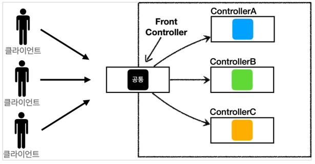
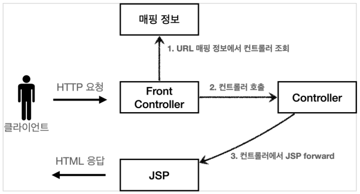
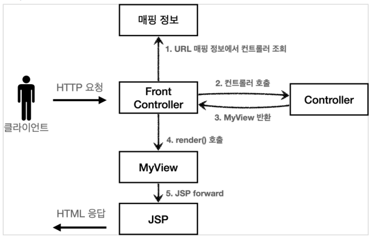
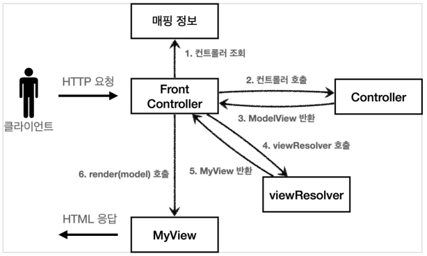
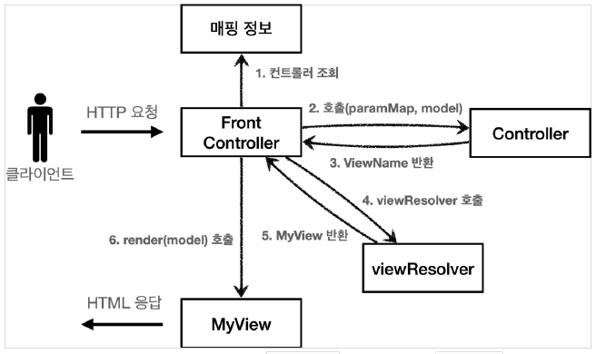
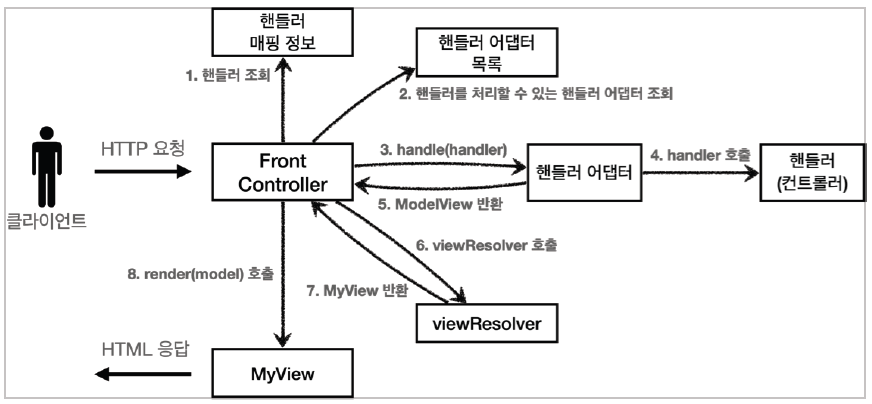

# MVC 프레임워크 만들기

---

## FrontController 패턴 특징

+ 프론트 컨트롤러 서블릿 하나로 클라이언트의 요청을 받음
+ 프론트 컨트롤러가 요청에 맞는 컨트롤러를 찾아서 호출
+ 입구를 하나로!
+ 공통 처리 가능
+ 프론트 컨트롤러를 제외한 나머지 컨트롤러는 서블릿을 사용하지 않아도 됨
    + 프론트 컨트롤러가 직접 호출




### 스프링 웹 MVC와 프론트 컨트롤러

스프링 웹 MVC의 핵심도 바로 FrontController

스프링 웹 MVC의 DispatcherServlet이 FrontController 패턴으로 구현되어 있음


## 프론트 컨트롤러 - v1

기존 코드를 최대한 유지하면서, 프론트 컨트롤러를 도입

---



web/frontcontroller/v1/ControllerV1

```java
public interface ControllerV1 {

    void process(HttpServletRequest request, HttpServletResponse response) throws ServletException, IOException;

}
```

서블릿과 비슷한 모양의 컨트롤러 인터페이스

각 컨트롤러는 이 인터페이스를 구현하면 된다. 프론트 컨트롤러는 이 인터페이스를 호출해서 구현과 관계 없이 로직의 일관성을 가져갈 수 있다.


web/frontcontroller/v1/controller/MemberFormControllerV1

```java
public class MemberFormControllerV1 implements ControllerV1 {
    @Override
    public void process(HttpServletRequest request, HttpServletResponse response) throws ServletException, IOException {
        String viewPath = "/WEB-INF/views/new-form.jsp";
        RequestDispatcher dispatcher = request.getRequestDispatcher(viewPath);
        dispatcher.forward(request,response);
    }
}
```

web/frontcontroller/v1/controller/MemberSaveControllerV1

```java
public class MemberSaveControllerV1 implements ControllerV1 {

    private MemberRepository memberRepository = MemberRepository.getInstance();
    @Override
    public void process(HttpServletRequest request, HttpServletResponse response) throws ServletException, IOException {
        String username = request.getParameter("username");
        int age = Integer.parseInt(request.getParameter("age"));

        Member member = new Member(username,age);
        memberRepository.save(member);

        //Model에 데이터를 보관한다.

        request.setAttribute("member",member);

        String viewPath = "/WEB-INF/views/save-result.jsp";
        RequestDispatcher dispatcher = request.getRequestDispatcher(viewPath);
        dispatcher.forward(request,response);
    }
}
```

web/frontcontroller/v1/controller/MemberListControllerV1

```java
public class MemberListControllerV1 implements ControllerV1 {

    private MemberRepository memberRepository = MemberRepository.getInstance();

    @Override
    public void process(HttpServletRequest request, HttpServletResponse response) throws ServletException, IOException {
        List<Member> members = memberRepository.findAll();

        request.setAttribute("members",members);


        String viewPath = "/WEB-INF/views/members.jsp";
        RequestDispatcher dispatcher = request.getRequestDispatcher(viewPath);
        dispatcher.forward(request,response);
    }
}
```

등록,저장,조회의 로직은 기존 서블릿과 거의 동일하다.

web/frontcontroller/v1/FrontControllerServletV1

```java
@WebServlet(name = "frontControllerServletV1", urlPatterns = "/front-controller/v1/*")
public class FrontControllerServletV1 extends HttpServlet {

    private Map<String, ControllerV1> controllerMap = new HashMap<>();

    public FrontControllerServletV1() {
        controllerMap.put("/front-controller/v1/members/new-form",new MemberFormControllerV1());
        controllerMap.put("/front-controller/v1/members/save",new MemberSaveControllerV1());
        controllerMap.put("/front-controller/v1/members",new MemberListControllerV1());
    }

    @Override
    protected void service(HttpServletRequest request, HttpServletResponse response) throws ServletException, IOException {
        System.out.println("FrontControllerServletV1.service");

        String requestURI = request.getRequestURI();

        ControllerV1 controller = controllerMap.get(requestURI);
        if(controller == null){
            response.setStatus(HttpServletResponse.SC_NOT_FOUND);
            return;
        }

        controller.process(request,response);
    }
}
```

`@WebServlet(name = "frontControllerServletV1", urlPatterns = "/front-controller/v1/*")`

urlPatterns = `/front-controller/v1/*` 은 하위 모든 요청을 받는다는 뜻

`private Map<String, ControllerV1> controllerMap = new HashMap<>();`

<Key, Value>를 매핑URL, 호출될 컨트롤러 형태로 생성자에서 저장한다.

---

## View 분리 - v2

모든 컨트롤러에서 뷰로 이동하는 부분에 중복이 있고 깔끔하지 않았다.

```java
String viewPath = "/WEB-INF/views/members.jsp";
RequestDispatcher dispatcher = request.getRequestDispatcher(viewPath);
dispatcher.forward(request,response);
```

v2에선 깔금하게 분리하기 위해 별도로 뷰를 처리하는 객체를 만든다.

---



v1에선 컨트롤러에서 직접 포워드 해주었는데 v2에선 객체를 만들어 반환하고 프론트 컨트롤러는 MyView객체만 반환하고 MyView객체가 렌더를 호출하여 포워드 하도록 바꾼다.

web/MyView

```java
public class MyView {

    private String viewPath;

    public MyView(String viewPath) {
        this.viewPath = viewPath;
    }

    public void render(HttpServletRequest request, HttpServletResponse response) throws ServletException, IOException{
        RequestDispatcher dispatcher = request.getRequestDispatcher(viewPath);
        dispatcher.forward(request,response);
    }
}
```

web/frontcontroller/v2/ControllerV2

```java
public interface ControllerV2 {

    MyView process(HttpServletRequest request, HttpServletResponse response) throws ServletException, IOException;

}
```

MyView 객체를 반환

web/frontcontrollerV2/controller/MemberFormControllerV2

```java
public class MemberFormControllerV2 implements ControllerV2 {
    @Override
    public MyView process(HttpServletRequest request, HttpServletResponse response) throws ServletException, IOException {
        return new MyView("/WEB-INF/views/new-form.jsp");
    }
}
```

web/frontcontrollerV2/controller/MemberSaveControllerV2

```java
public class MemberSaveControllerV2 implements ControllerV2 {

    private MemberRepository memberRepository = MemberRepository.getInstance();

    @Override
    public MyView process(HttpServletRequest request, HttpServletResponse response) throws ServletException, IOException {
        String username = request.getParameter("username");
        int age = Integer.parseInt(request.getParameter("age"));

        Member member = new Member(username,age);
        memberRepository.save(member);

        //Model에 데이터를 보관한다.
        request.setAttribute("member",member);

        return new MyView("/WEB-INF/views/save-result.jsp");
    }
}
```

web/frontcontrollerV2/controller/MemberListControllerV2

```java
public class MemberListControllerV2 implements ControllerV2 {
    
    private MemberRepository memberRepository = MemberRepository.getInstance();
    
    @Override
    public MyView process(HttpServletRequest request, HttpServletResponse response) throws ServletException, IOException {
        List<Member> members = memberRepository.findAll();
        request.setAttribute("members",members);
        return new MyView("/WEB-INF/views/members.jsp");
    }
}
```

각 컨트롤러들은 `dispatcher.forward()`를 생성해서 호출하지 않고 단순히 MyView 객체를 생성하고 뷰 이름만 넣어서 반환해준다.

프론트 컨트롤러의 도입으로 MyView 객체의 `render()`를 호출하는 부분을 일관되게 처리하고 각 컨트롤러는 `MyView` 객체를 생성만 해서 반환해준다.

---

## Model 추가 - v3

**서블릿 종속성 제거**

컨트롤러 입장에서 HttpServletRequest,HttpServletResponse가 필요할까?

파라미터 정보는 Map으로 대신 넘기도록 하여 지금 구조에서는 컨트롤러가 서블릿 기술을 몰라도 동작할 수 있다.

그리고 request 객체를 Model로 사용하는 대신에 별도의 Model 객체를 만들어서 반환하면 된다.


**뷰 이름 중복 제거**
컨트롤러에서 지정하는 뷰 이름에 중복이 있다.

컨트롤러는 뷰의 논리 이름을 반환하고, 실제 물리 위치의 이름은 프론트 컨트롤러에서 처리하도록 단순화 시키자.

+ `/WEB-INF/view/new-form.jsp` -> new-form
+ `/WEB-INF/view/save-result.jsp` -> save-result
+ `/WEB-INF/view/members.jsp` -> members

---




### ModelView

지금까지 컨트롤러에서 서블릿에 종속적인 HttpServletRequest를 사용했다. Model 또한 `setAttribute()`를 통해 데이터를 저장하고 뷰에 전달했다.

web/frontcontroller/ModelView

```java
public class ModelView {
    private String viewName;
    private Map<String, Object> model = new HashMap<>();

    public ModelView(String viewName) {
        this.viewName = viewName;
    }

    public String getViewName() {
        return viewName;
    }

    public void setViewName(String viewName) {
        this.viewName = viewName;
    }

    public Map<String, Object> getModel() {
        return model;
    }

    public void setModel(Map<String, Object> model) {
        this.model = model;
    }
}
```

뷰의 이름과 뷰를 렌더링할때 필요한 model 객체를 가지고 있다.

model은 컨트롤러에서 뷰에 필요한 key,value를 넣어준다.


web/frontcontroller/v3/ControllerV3

```java
public interface ControllerV3 {

    ModelView process(Map<String,String> paramMap);

}
```

HttpServletRequest가 제공하는 파라미터는 프론트 컨트롤러가 paramMap에 담아서 호출해 줄 것이다.

응답 결과로 뷰 이름과 뷰에 전달할 Model 데이터를 포함하는 ModelView 객체를 반환한다.


web/frontcontroller/v3/controller/MemberFormControllerV3

```java
public class MemberFormControllerV3 implements ControllerV3 {
    @Override
    public ModelView process(Map<String, String> paramMap) {
        return new ModelView("new-form");
    }
}
```

ModelView를 생성할 때 `new-form`이라는 논리적인 이름을 저장해서 반환한다. 실제 물리적인 이름은 프론트 컨트롤러에서 처리한다.


web/frontcontroller/v3/controller/MemberSaveControllerV3

```java
public class MemberSaveControllerV3 implements ControllerV3 {

    private MemberRepository memberRepository = MemberRepository.getInstance();

    @Override
    public ModelView process(Map<String, String> paramMap) {
        String username = paramMap.get("username");
        int age = Integer.parseInt(paramMap.get("age"));

        Member member = new Member(username, age);

        memberRepository.save(member);

        ModelView mv = new ModelView("save-result");
        mv.getModel().put("member",member);
        return mv;
    }
}
```

`paramMap.get()`으로 요청 파라미터를 조회한다.

`mvc.getModel().put()` 모델은 단순한 Map이므로 모델에 뷰에서 필요한 `member`객체를 담아서 반환한다.


web/frontcontroller/v3/controller/MemberListControllerV3

```java
public class MemberListControllerV3 implements ControllerV3 {
    private MemberRepository memberRepository = MemberRepository.getInstance();

    @Override
    public ModelView process(Map<String, String> paramMap) {
        List<Member> members = memberRepository.findAll();
        ModelView mv = new ModelView("members");
        mv.getModel().put("members",members);

        return mv;
    }
}
```

web/frontcontroller/v3/controller/FrontControllerServletV3

```java
@WebServlet(name = "frontControllerServletV3", urlPatterns = "/front-controller/v3/*")
public class FrontControllerServletV3 extends HttpServlet {

    private Map<String, ControllerV3> controllerMap = new HashMap<>();

    public FrontControllerServletV3() {
        controllerMap.put("/front-controller/v3/members/new-form", new MemberFormControllerV3());
        controllerMap.put("/front-controller/v3/members/save", new MemberSaveControllerV3());
        controllerMap.put("/front-controller/v3/members", new MemberListControllerV3());
    }

    @Override
    protected void service(HttpServletRequest request, HttpServletResponse response) throws ServletException, IOException {

        String requestURI = request.getRequestURI();

        ControllerV3 controller = controllerMap.get(requestURI);
        if (controller == null) {
            response.setStatus(HttpServletResponse.SC_NOT_FOUND);
            return;
        }


        //paramMap을 넘겨줘야됨
        Map<String, String> paramMap = createParamMap(request);

        ModelView mv = controller.process(paramMap);

        String viewName = mv.getViewName();

        MyView view = viewResolver(viewName);

        view.render(mv.getModel(),request,response);


    }

    private MyView viewResolver(String viewName) {
        return new MyView("/WEB-INF/views/" + viewName + ".jsp");
    }

    private Map<String, String> createParamMap(HttpServletRequest request) {
        Map<String, String> paramMap = new HashMap<>();
        request.getParameterNames().asIterator()
                .forEachRemaining(paramName -> paramMap.put(paramName, request.getParameter(paramName)));
        return paramMap;
    }
}
```
`createParamMap()` : HttpServletRequest에서 파라미터 정보를 꺼내서 Map으로 변환한다. 

list,new-form의 경우엔 Map에 아무것도 들어가지 않는다.

`viewResolver()` : 컨트롤러가 반환하는 논리 뷰 이름을 실제 물리 뷰 경로로 변경한다. 그리고 실제 물리 경로가 있는 MyView 객체를 반환해준다.

`view.render(mvc.getModel(),request,response)` : 뷰 객체를 통해서 HTMl 화면을 렌더링 한다.


web/frontcontroller/MyView

```java
public class MyView {

    private String viewPath;

    public MyView(String viewPath) {
        this.viewPath = viewPath;
    }

    public void render(HttpServletRequest request, HttpServletResponse response) throws ServletException, IOException{
        RequestDispatcher dispatcher = request.getRequestDispatcher(viewPath);
        dispatcher.forward(request,response);
    }

    public void render(Map<String, Object> model, HttpServletRequest request, HttpServletResponse response) throws ServletException, IOException {
        modelToRequestAttribute(model, request);
        RequestDispatcher dispatcher = request.getRequestDispatcher(viewPath);
        dispatcher.forward(request,response);
    }

    private void modelToRequestAttribute(Map<String, Object> model, HttpServletRequest request) {
        model.forEach((key, value) -> request.setAttribute(key,value));
    }
}
```

JSP는 `request.getAttribute()`로 데이터를 조회하기 때문에, 모델의 데이터를 꺼내서 `request.setAttribute()`로 담아둔다.

---

## 단순하고 실용적인 컨트롤러 - v4

좋은 프레임워크는 아키텍쳐도 중요하지만, 개발자가 단순하고 편리하게 사용할 수 있어야 한다.

---



v4는 컨트롤러에서 ModelView를 반환하지 않고 ViewName만 반환하게 설계한다.

web/frontcontroller/v4/ControllerV4

```java
public interface ControllerV4 {
    /**
     *
     * @param paramMap
     * @param model
     * @return viewName
     */
    String process(Map<String, String> paramMap, Map<String, Object> model);

}
```

뷰의 이름만 반환한다.


web/frontcontroller/v4/controller/MemberFormControllerV4

```java
public class MemberFormControllerV4 implements ControllerV4 {

    @Override
    public String process(Map<String, String> paramMap, Map<String, Object> model) {
        return "new-form";
    }
}
```

단순하게 `new-form` 뷰의 논리 이름만 반환.


web/frontcontroller/v4/controller/MemberSaveControllerV4

```java
public class MemberSaveControllerV4 implements ControllerV4 {

    private MemberRepository memberRepository = MemberRepository.getInstance();

    @Override
    public String process(Map<String, String> paramMap, Map<String, Object> model) {
        String username = paramMap.get("username");
        int age = Integer.parseInt(paramMap.get("age"));

        Member member = new Member(username, age);

        memberRepository.save(member);

        model.put("member",member);

        return "save-result";
    }
}
```

모델이 프론트 컨트롤러에서 파라미터로 전달되기 때문에 모델을 직접 생성하지 않는다.

web/frontcontroller/v4/controller/MemberListControllerV4

```java
public class MemberListControllerV4 implements ControllerV4 {
    private MemberRepository memberRepository = MemberRepository.getInstance();


    @Override
    public String process(Map<String, String> paramMap, Map<String, Object> model) {
        List<Member> members = memberRepository.findAll();
        model.put("members",members);

        return "members";
    }
}
```

web/frontcontroller/v4/FrontControllerV4

```java
@WebServlet(name = "frontControllerServletV4", urlPatterns = "/front-controller/v4/*")
public class FrontControllerServletV4 extends HttpServlet {

    private Map<String, ControllerV4> controllerMap = new HashMap<>();

    public FrontControllerServletV4() {
        controllerMap.put("/front-controller/v4/members/new-form", new MemberFormControllerV4());
        controllerMap.put("/front-controller/v4/members/save", new MemberSaveControllerV4());
        controllerMap.put("/front-controller/v4/members", new MemberListControllerV4());
    }

    @Override
    protected void service(HttpServletRequest request, HttpServletResponse response) throws ServletException, IOException {

        String requestURI = request.getRequestURI();

        ControllerV4 controller = controllerMap.get(requestURI);
        if (controller == null) {
            response.setStatus(HttpServletResponse.SC_NOT_FOUND);
            return;
        }


        //paramMap을 넘겨줘야됨
        Map<String, String> paramMap = createParamMap(request);
        Map<String, Object> model = new HashMap<>(); //추가
        String viewName = controller.process(paramMap, model);

        System.out.println(model);
        MyView view = viewResolver(viewName);

        view.render(model,request,response);
    }

    private MyView viewResolver(String viewName) {
        return new MyView("/WEB-INF/views/" + viewName + ".jsp");
    }

    private Map<String, String> createParamMap(HttpServletRequest request) {
        Map<String, String> paramMap = new HashMap<>();
        request.getParameterNames().asIterator()
                .forEachRemaining(paramName -> paramMap.put(paramName, request.getParameter(paramName)));
        return paramMap;
    }
}
```

v3와 거의 동일한데 `Map<String, Object> model = new HashMap();`으로 model을 프론트 컨트롤러에서 생성해서 넘겨준다.

---

## 유연한 컨트롤러1 - v5

여떤 개발자는 ControllerV3 로 개발하고 싶고 다른 개발자는 ControllerV4 방식으로 개발하고 싶다면 어떻게 해야할까?

---

### 어댑터 패턴

지금까지 개발한 프론트 컨트롤러는 한가지 방식의 컨트롤러 인터페이스만 사용할 수 있다. -> **호환 불가**

어댑터 패턴을 사용하면 프론트 컨트롤러가 다양한 방식의 컨트롤러를 처리할 수 있다.




+ 핸들러 어댑터: 어댑터 역할을 해주는 덕분에 다양한 종류의 컨트롤러를 호출할 수 있다.
+ 핸들러: 컨트롤러의 이름을 더 넓은 범위인 핸들러로 변경. 어댑터가 있기 때문에 꼭 컨트롤러의 개념 뿐만 아니라 어떠한 것이든 해당하는 종류의 어댑터만 있으면 처리할 수 있다.


web/frontcontroller/v5/MyHandlerAdapter

```java
public interface MyHandlerAdapter {

    boolean supports(Object handler);

    ModelView handle(HttpServletRequest request, HttpServletResponse response,Object handler) throws ServletException, IOException;
}
```


`supports(Obejct handler)` : handler는 컨트롤러를 말하고 어댑터가 해당 컨트롤러를 처리할 수 있는지 판단하는 메서드이다.

`ModelView handle(HttpServletReuqest request, HttpServletResponse respone, Object handler)`

+ 어댑터는 실제 컨트롤러를 호출하고 결과로 ModelView를 반환한다.
+ 실제 컨트롤러가 ModelView를 반환하지 못하면, 어댑터가 ModelView를 직접 생성해서라도 반환해야 한다.
+ 이전에는 프론트 컨트롤러가 실제 컨트롤러를 호출했지만, 어댑터를 통해서 실제 컨트톨러가 호출된다.


web/frontcontroller/v5/adapter/ControllerV3HandlerAdapter


```java
public class ControllerV3HandlerAdapter implements MyHandlerAdapter {
    @Override
    public boolean supports(Object handler) {
        return (handler instanceof ControllerV3);
    }

    @Override
    public ModelView handle(HttpServletRequest request, HttpServletResponse response, Object handler) throws ServletException, IOException {
        ControllerV3 controller = (ControllerV3) handler;
        Map<String, String> paramMap = createParamMap(request);
        ModelView mv = controller.process(paramMap);

        return mv;
    }

    private Map<String, String> createParamMap(HttpServletRequest request) {
        Map<String, String> paramMap = new HashMap<>();
        request.getParameterNames().asIterator()
                .forEachRemaining(paramName -> paramMap.put(paramName, request.getParameter(paramName)));
        return paramMap;
    }
}
```

`supports`: `ControllerV3`를 처리할 수 있는 어댑터 


```java
    @Override
    public ModelView handle(HttpServletRequest request, HttpServletResponse response, Object handler) throws ServletException, IOException {
        ControllerV3 controller = (ControllerV3) handler;
        Map<String, String> paramMap = createParamMap(request);
        ModelView mv = controller.process(paramMap);

        return mv;
    }
```

handler를 컨트롤러V3로 변환하고 V3 형식에 맞추어 호출한다.

ControllerV3는 ModelView를 반환하므로 그대로 ModelView를 반환하면 된다.


web/frontcontroller/v5/FrontControllerServletV5

```java
@WebServlet(name = "frontControllerServletV5",urlPatterns = "/front-controller/v5/*")
public class FrontControllerServletV5 extends HttpServlet {

    private final Map<String, Object> handlerMappingMap = new HashMap<>();
    private final List<MyHandlerAdapter> handlerAdapters = new ArrayList<>();

    public FrontControllerServletV5(){
        initHandlerMappingMap();

        initHandlerAdapters();
    }

    private void initHandlerMappingMap() {
        handlerMappingMap.put("/front-controller/v5/v3/members/new-form", new MemberFormControllerV3());
        handlerMappingMap.put("/front-controller/v5/v3/members/save", new MemberSaveControllerV3());
        handlerMappingMap.put("/front-controller/v5/v3/members", new MemberListControllerV3());
    }

    private void initHandlerAdapters() {
        handlerAdapters.add(new ControllerV3HandlerAdapter());
    }


    @Override
    protected void service(HttpServletRequest request, HttpServletResponse response) throws ServletException, IOException {

        Object handler = getHandler(request);

        if (handler == null) {
            response.setStatus(HttpServletResponse.SC_NOT_FOUND);
            return;
        }

        MyHandlerAdapter adapter = getHandlerAdapter(handler);

        ModelView mv = adapter.handle(request, response, handler);

        MyView view = viewResolver(mv.getViewName());

        view.render(mv.getModel(),request,response);


    }

    private MyHandlerAdapter getHandlerAdapter(Object handler) {
        for (MyHandlerAdapter adapter : handlerAdapters) {
            if(adapter.supports(handler)){
                return adapter;
            }
        }
        throw new IllegalArgumentException("handler adapter를 찾을 수 없습니다. handler=" + handler);
    }

    private Object getHandler(HttpServletRequest request) {
        String requestURI = request.getRequestURI();
        return  handlerMappingMap.get(requestURI);
    }

    private MyView viewResolver(String viewName){
        return new MyView("/WEB-INF/views/" + viewName + ".jsp");
    }

}
```

```java
    private void initHandlerMappingMap() {
        handlerMappingMap.put("/front-controller/v5/v3/members/new-form", new MemberFormControllerV3());
        handlerMappingMap.put("/front-controller/v5/v3/members/save", new MemberSaveControllerV3());
        handlerMappingMap.put("/front-controller/v5/v3/members", new MemberListControllerV3());
    }

    private void initHandlerAdapters() {
        handlerAdapters.add(new ControllerV3HandlerAdapter());
    }
```

생성자에서 핸들러 매핑과 어댑터를 초기화(등록) 한다.

매핑 정보 `private final Map<String, Object> handlerMappingMap = new HashMap();` 매핑 정보의 값이 `ControllerV3`, `ControllerV4`같은 인터페이스에서 아무 값이나 받을 수 있도록 `Object`로 사용한다.

`Object handler = getHandler(request);`

```java
    private Object getHandler(HttpServletRequest request) {
        String requestURI = request.getRequestURI();
        return  handlerMappingMap.get(requestURI);
    }
```

핸들러 매핑 정보인 handlerMappingMap에서 URL에 매핑된 핸들러(컨트롤러) 객체를 찾아서 반환한다.


`MyHandlerAdapter adapter = getHandlerAdapter(handler);` 

```java
    private MyHandlerAdapter getHandlerAdapter(Object handler) {
        for (MyHandlerAdapter adapter : handlerAdapters) {
            if(adapter.supports(handler)){
                return adapter;
            }
        }
        throw new IllegalArgumentException("handler adapter를 찾을 수 없습니다. handler=" + handler);
    }
```

`handler`를 처리할 수 있는 어댑터를 `adapter.supports(handler)`를 통해서 찾는다.

handler가 `ControllerV3`인터페이스를 구현했다면, `ControllerV3HandlerAdapter` 객체가 반환된다.

---

## 유연한 컨트롤러2 - v5

`FrontControllerServletV5`에 `ControllerV4` 기능 추가

---

```java
  private void initHandlerMappingMap() {
        handlerMappingMap.put("/front-controller/v5/v3/members/new-form", new MemberFormControllerV3());
        handlerMappingMap.put("/front-controller/v5/v3/members/save", new MemberSaveControllerV3());
        handlerMappingMap.put("/front-controller/v5/v3/members", new MemberListControllerV3());

        //V4 추가
        handlerMappingMap.put("/front-controller/v5/v4/members/new-form", new MemberFormControllerV4());
        handlerMappingMap.put("/front-controller/v5/v4/members/save", new MemberSaveControllerV4());
        handlerMappingMap.put("/front-controller/v5/v4/members", new MemberListControllerV4());
    }

    private void initHandlerAdapters() {
        handlerAdapters.add(new ControllerV3HandlerAdapter());
        handlerAdapters.add(new ControllerV4HandlerAdapter());
    }
```

V4 정보 추가

```java
@Override
protected void service(HttpServletRequest request, HttpServletResponse response) throws ServletException, IOException {

        Object handler = getHandler(request);

        if (handler == null) {
        response.setStatus(HttpServletResponse.SC_NOT_FOUND);
        return;
        }

        MyHandlerAdapter adapter = getHandlerAdapter(handler);

        ModelView mv = adapter.handle(request, response, handler);

        MyView view = viewResolver(mv.getViewName());

        view.render(mv.getModel(),request,response);
        }
```


member/new-form 예시


`Object handler = getHandler(request);` reqeustURI로 handler를 찾는다.

Object handler = MemberFormControllerV4

`MyHandlerAdapter adapter = getHandlerAdapter(handler);`: adapter 찾기

MyHandlerAdapter adapter = ControllerV4HandlerAdapter


```java
private MyHandlerAdapter getHandlerAdapter(Object handler) {
        for (MyHandlerAdapter adapter : handlerAdapters) {
            if(adapter.supports(handler)){
                return adapter;
            }
        }
        throw new IllegalArgumentException("handler adapter를 찾을 수 없습니다. handler=" + handler);
    }
```

```java
    @Override
    public ModelView handle(HttpServletRequest request, HttpServletResponse response, Object handler) throws ServletException, IOException {
        ControllerV4 controller = (ControllerV4) handler;

        Map<String,String> paramMap = createParamMap(request);
        HashMap<String, Object> model = new HashMap<>();
        String viewName = controller.process(paramMap, model);

        ModelView mv = new ModelView(viewName);
        mv.setModel(model);

        return mv;
    }
```

paramMap, model을 넘겨주고 viewName으로 ModelView를 만들고 ModelView를 반호나해준다.


어댑터를 도입하면 프레임워크를 유연하고 확장성 있게 설계가 가능하다.
