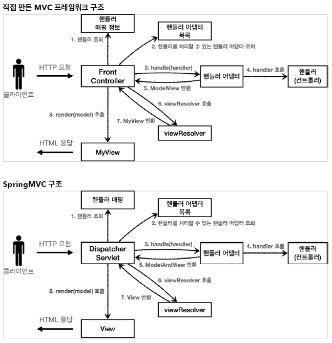
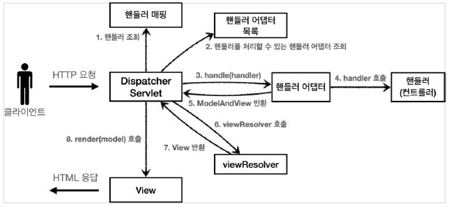

# 스프링 MVC - 구조 이해

---

## 스프링 MVC 전체 구조



**직접 만든 프레임워크 -> 스프링 MVC 비교**

+ FrontController -> DispatcherServlet
+ handlerMappingMap -> HandlerMapping
+ MyHandlerAdapter -> HandlerAdapter
+ ModelView -> ModelAndView
+ viewResolver -> ViewResolver(Interface)
+ MyView -> View(Interface)

### DispatcherServlet

스프링 MVC 프론트 컨트롤러 패턴으로 구현되어 있다.

+ `DispatcherServlet`도 부모 클래스에서 `HttpServlet`을 상속 받아서 사용하고, 서블릿으로 동작한다.
    + DispatcherServlet -> FrameworkServlet -> HttpServletBean -> HttpServlet
+ 스프링부트는 `DispatcherServlet`을 서블릿으로 자동으로 등록하면서 **모든 경로**`urlPattenrs="/")에 대해서 매핑한다.
    + 참고: 더 자세한 경로가 우선순위가 높다.

**요청 흐름**

+ 서블릿이 호출되면 `HttpServlet`이 제공하는 `service()`가 호출된다.
+ `FrameworkServlet.service()`를 시작으로 여러 메서드가 호출되면서 `DispatcherServlet.doDispatch()`가 호출된다.

`Dispatcher.doDispatch()`

```java
protected void doDispatch(HttpServletRequest request, HttpServletResponse
        response) throws Exception {
        HttpServletRequest processedRequest = request;
        HandlerExecutionChain mappedHandler = null;
        ModelAndView mv = null;
        // 1. 핸들러 조회
        mappedHandler = getHandler(processedRequest);
        if (mappedHandler == null) {
        noHandlerFound(processedRequest, response);
        return;
        }
        
        // 2. 핸들러 어댑터 조회 - 핸들러를 처리할 수 있는 어댑터
        HandlerAdapter ha = getHandlerAdapter(mappedHandler.getHandler());
        
        // 3. 핸들러 어댑터 실행 -> 4. 핸들러 어댑터를 통해 핸들러 실행 -> 5. ModelAndView 반환
        mv = ha.handle(processedRequest, response, mappedHandler.getHandler());
        processDispatchResult(processedRequest, response, mappedHandler, mv,
        dispatchException);
}
        
private void processDispatchResult(HttpServletRequest request,
        HttpServletResponse response, HandlerExecutionChain mappedHandler, ModelAndView
        mv, Exception exception) throws Exception {
    
        // 뷰 렌더링 호출
        render(mv, request, response);
        
}
        
protected void render(ModelAndView mv, HttpServletRequest request,
        HttpServletResponse response) throws Exception {
    
        View view;
        String viewName = mv.getViewName();
        
        // 6. 뷰 리졸버를 통해서 뷰 찾기, 7. View 반환
        view = resolveViewName(viewName, mv.getModelInternal(), locale, request);
        
        // 8. 뷰 렌더링
        view.render(mv.getModelInternal(), request, response);
}
```
---

### 스프링 MVC 구조



**동작 순서**
1. 핸들러 조회: 핸들러 매핑을 통해 요청 URL에 매핑된 핸들러(컨트롤러)를 조회한다.
2. 핸들러 어댑터 조회: 핸들러를 실행할 수 있는 핸들러 어댑터를 조회한다.
3. 핸들러 어댑터 실행: 핸들러 어댑터를 실행한다.
4. 핸들러 실행: 핸들러 어댑터가 실제 핸들러를 실행한다.
5. ModelAndView 반환: 핸들러 어댑터는 핸들러가 반환하는 정보를 ModelAndView로 변환해서 반환한다.
6. viewResolver 호출: 뷰 리졸버를 찾고 실행한다.
7. view 반환: 뷰 리졸버는 뷰의 논리 이름을 물리 이름으로 바꾸고 렌더링 역할을 담당하는 뷰 객체를 반환한다.
8. 뷰 렌더링: 뷰를 통해서 뷰를 렌더링 한다.


---

## 핸들러 매핑과 핸들러 어댑터

---

### Controller 인터페이스

과거에 스프링이 제공했던 간단한 컨트롤러로 핸들러 매핑과 어댑터를 이해해보자.

> `Controller` 인터페이스는 `@Controller` 애노테이션과 전혀 다르다.

```java
@Component("/springmvc/old-controller")
public class OldController implements Controller {
    @Override
    public ModelAndView handleRequest(HttpServletRequest request, HttpServletResponse response) throws Exception {
        System.out.println("OldController.handleRequest");
        return null;
    }
}
```


컨트롤러가 호출되려면 2가지가 필요

+ **HandlerMapping**
  + 핸들러 매핑에서 컨트롤러를 찾을 수 있어야 한다.
  + ex) 스프링 빈의 이름으로 핸들러를 찾을 수 있는 핸들러 매핑이 필요하다.
+ **HandlerAdapter**
  + 핸들러 매핑을 통해 찾은 핸들러에서 실행할 수 있는 핸들러 어댑터가 필요하다.
  + ex) `Controller` 인터페이스를 실행할 수 있는 핸들러 어댑터를 찾고 실행해야 한다.


> 스프링은 이미 필요한 핸들러 매핑과 핸들러 어댑터를 대부분 구현해두었다. 개발자가 직접 핸들러 매핑과 핸들러 어댑터를 만드는 일은 거의 없다.

**HandlerMapping**
```text
0 = RequestMappingHandlerMapping : 애노테이션 기반의 컨트롤러인 @RequestMapping에서 사용

1 = BeanNameUrlHandlerMapping : 스프링 빈의 이름으로 핸들러를 찾는다.
```


**HandlerAdapter**
```text
0 = RequestMappingHandlerAdapter : 애노테이션 기반의 컨트롤러인 @RequestMapping에서 사용

1 = HttpRequestHandlerAdapter : HttpRequestHandler 처리

2 = SimpleControllerHandlerAdapter : Controller 인터페이스
```

### 1. 핸들러 매핑으로 핸들러 조회

1. `HandlerMapping`을 순서대로 실행해서 핸들러를 찾는다.
2. OldController의 경우 빈 이름으로 핸들러를 찾아주는 `BeanNameUrlHandlerMapping`이 실행에 성공하고 핸들러인 `OldController`를 반환한다.

### 2. 핸들러 어댑터 조회

1. `HandlerAdapter`의 `supports()`를 순서대로 호출한다.
2. `SimpleControllerHandlerAdapter`가 `Controller` 인터페이스를 지원하므로 대상이 된다.

### 3. 핸들러 어댑터 실행

1. 디스패처 서블릿이 조회한 `SimpleControllerHandlerAdapter`를 실행하면서 핸들러 정보도 함께 넘겨준다.
2. `SimpleControllerHandlerAdapter`는 핸들러인 `OldController`를 내부에서 실행하겨 그 결과를 반환한다.


HttpRequestHandler도 비슷하게 동작한다.

```java
@Component("/springmvc/request-handler")
public class MyHttpRequestHandler implements HttpRequestHandler {
    @Override
    public void handleRequest(HttpServletRequest request, HttpServletResponse response) throws ServletException, IOException {
        System.out.println("MyHttpRequestHandler.handleRequest");
    }
}
```

---

## 뷰 리졸버

View를 사용하기 위해 OldController에 `return new ModelAndView("new-form")`을 추가한다.

```java
@Component("/springmvc/old-controller")
public class OldController implements Controller {
    @Override
    public ModelAndView handleRequest(HttpServletRequest request, HttpServletResponse response) throws Exception {
        System.out.println("OldController.handleRequest");
        return new ModelAndView("new-form");
    }
}
```

`application.properties`에 코드를 추가한다.

```text
spring.mvc.view.prefix=/WEB-INF/views/
spring.mvc.view.suffix=.jsp
```

스프링 부트는 `InternalResourceViewResolver`라는 뷰 리졸버를 자동으로 등록하는데 이때 
properties에 등록한 prefix, suffix 설정 정보를 사용해서 등록한다.


### 스프링 부트가 자동으로 등록하는 뷰 리졸버

```text
1 = BeanNameViewResolver : 빈 이름으로 뷰를 찾아서 반환한다.

2 = InternalResourceViewResolver : JPS를 처리할 수 있는 뷰를 반환한다.

```

### 1. 핸들러 어댑터 호출

핸들러 어댑터를 통해 `new-form`이라는 논리 뷰 이름을 획득한다.


### 2. ViewResolver 호출

1. `new-form`이라는 뷰 이름으로 viewResolver를 순서대로 호출한다.
2. `BeanNameViewResolver`는 `new-form`이라는 이름의 스프링 빈으로 등록된 뷰를 찾아야 하는데 없다.
3. `InternalResourceViewRsolver`가 호출된다.

### 3. InternalResourceViewResolver

이 뷰 리졸버는 InternalResourceView를 반환한다.

### 4. 뷰 - InternalResourceView

`InternalResourceView`는 JSP처럼 포워드를 호출해서 처리할 수 있는 경우에 사용한다.

### 5. view.render()

`view.render()`가 호출되고 `InternalResourceView`는 `forward()`를 사용해서 JSP를 실행한다.

---

## 스프링 MVC - 시작하기

---

**@RequestMapping**

스프링은 애노테이션을 활용한 매우 유연하고, 실용적인 컨트롤러를 만들었는데 이것이 바로 `@RequestMapping`애노테이션을 사용하는 컨트롤러이다.


`@RequestMapping`

+ `RequestMappingHandlerMapping`
+ `RequestMappingHandlerAdapter`

가장 우선순위가 높은 핸들러 매핑과 핸들러 어댑터는 `RequestMappingHandlerMapping`, `RequestMappingHandlerAdapter`이다.

실무에서는 99.9% 이 방식의 컨트롤러를 사용한다.


### SpringMemberFormControllerV1 - 회원 등록 폼

```java
@Controller
public class SpringMemberFormControllerV1 {

    @RequestMapping("/springmvc/v1/members/new-form")
    public ModelAndView process(){
        return new ModelAndView("new-form");
    }
}
```

+ `@Controller`
  + 스프링이 자등으로 스프링 빈으로 등록한다. (내부에 `@Component` 애노테이션이 있어서 컴포넌트 스캔의 대상이 됨)
  + 스프링 MVC에서 애노테이션 기반 컨트롤러로 인식한다.
+ `@RequestMapping` 
  + 요청 정보를 매핑
  + URL이 호출되면 이 메서드가 호출된다.
+ `ModelAndView`
  + 모델과 뷰 정보를 담아서 반환


`RequestMappingHandlerMapping`은 스프링 빈 중에서 `@ReqeustMapping`또는 `@Controller`가 클래스 레벨에 붙어있는 경우 매핑 정보로 인식한다.

```java
@Component
@RequestMapping
public class SpringMemberFormControllerV1 {

    @RequestMapping("/springmvc/v1/members/new-form")
    public ModelAndView process(){
        return new ModelAndView("new-form");
    }
}
```

위 코드도 동일하게 동작한다.

### SpringMemberSaveControllerV1 - 회원 저장

```java
@Controller
public class SpringMemberSaveControllerV1 {

    private MemberRepository memberRepository = MemberRepository.getInstance();

    @RequestMapping("/springmvc/v1/members/save")
    public ModelAndView process(HttpServletRequest request, HttpServletResponse response) {
        String username = request.getParameter("username");
        int age = Integer.parseInt(request.getParameter("age"));

        Member member = new Member(username, age);

        memberRepository.save(member);

        ModelAndView mv = new ModelAndView("save-result");
        mv.addObject("member",member);
        return mv;
    }
}
```

### SpringMemberListControllerV1 - 회원 목록

```java
@Controller
public class SpringMemberListControllerV1 {
    private MemberRepository memberRepository = MemberRepository.getInstance();


    @RequestMapping("/springmvc/v1/members")
    public ModelAndView process() {
        List<Member> members = memberRepository.findAll();
        ModelAndView mv = new ModelAndView("members");
        mv.addObject("members",members);

        return mv;
    }
}
```

`mv.addObject("member",member)`
+ 스프링이 제공하는 `ModelAndView`를 통해 Model 데이터를 추가할 때는 `addObject()`를 사용하면 된다. 
+ 이 데이터는 뷰를 렌더링할 때 사용된다.

---

## 스프링 MVC - 컨트롤러 통합

`@RequestMapping`을 잘 보면 클래스 단위가 아니라 메서드 단위에 적용된 것을 확인할 수 있다. 따라서 컨트롤러 클래스를 유연하게 하나로 통합할 수 있다.

---

### SpringMemberControllerV2

```java
@Controller
@RequestMapping("/springmvc/v2/members")
public class SpringMemberControllerV2 {

    private MemberRepository memberRepository = MemberRepository.getInstance();

    @RequestMapping("/new-form")
    public ModelAndView newForm(){
        return new ModelAndView("new-form");
    }

    @RequestMapping("/save")
    public ModelAndView save(HttpServletRequest request, HttpServletResponse response) {
        String username = request.getParameter("username");
        int age = Integer.parseInt(request.getParameter("age"));

        Member member = new Member(username, age);

        memberRepository.save(member);

        ModelAndView mv = new ModelAndView("save-result");
        mv.addObject("member",member);
        return mv;
    }

    @RequestMapping
    public ModelAndView members() {
        List<Member> members = memberRepository.findAll();
        ModelAndView mv = new ModelAndView("members");
        mv.addObject("members",members);

        return mv;
    }
}
```

컨트롤러 클래스들을 하나로 통합한다.

메서드들을 하나의 클래스 안에 두고 `@RequestMapping`을 조합하면 클래스 레벨과 메서드 레벨끼리 조합이 가능해진다.

---

## 스프링 MVC - 실용적인 방식

스프링 MVC는 개발자가 편리하게 개발할 수 있도록 많은 편의 기능을 제공한다.

---

### SpringMemberControllerV3

```java
@Controller
@RequestMapping("/springmvc/v3/members")
public class SpringMemberControllerV3 {
    private MemberRepository memberRepository = MemberRepository.getInstance();

    @GetMapping("/new-form")
    public String newForm() {
        return "new-form";
    }

    @PostMapping("/save")
    public String save(@RequestParam("username") String username,
                             @RequestParam("age") int age,
                             Model model) {

        Member member = new Member(username, age);
        memberRepository.save(member);

        model.addAttribute("member",member);
        return "save-result";
    }

    @GetMapping
    public String members(Model model) {
        List<Member> members = memberRepository.findAll();
        model.addAttribute("members",members);

        return "members";
    }
}
```

**Model 파라미터**

Model을 파라미터로 받을 수 있다.

**@RequestParam**

`@RequestParam("username") String username, @RequestParam("age") int age`으로 요청 파라미터를 받을 수 있다.

**@GetMapping, @PostMapping**

`@RequestMapping`은 URL 매핑 뿐 아니라 HTTP Method도 함께 구분할 수 있다.

`@RequestMapping(value = "/new-form", method = RequestMethod.GET)` 처럼 받을 수 있는데

`@GetMapping`, `@PostMapping`으로 더 편리하게 받을 수 있다.

