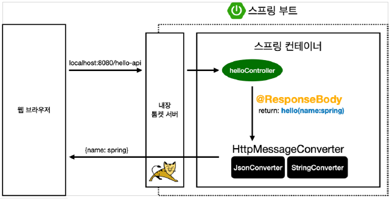
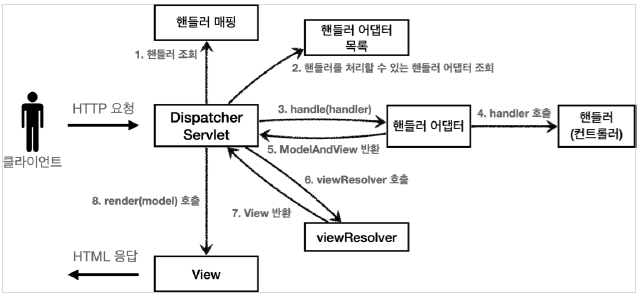
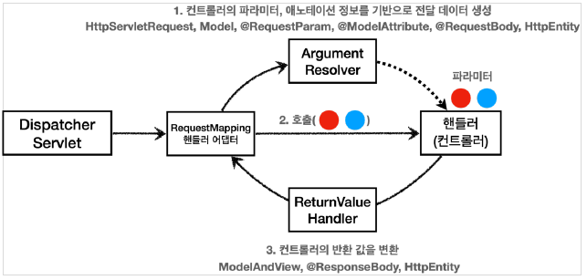
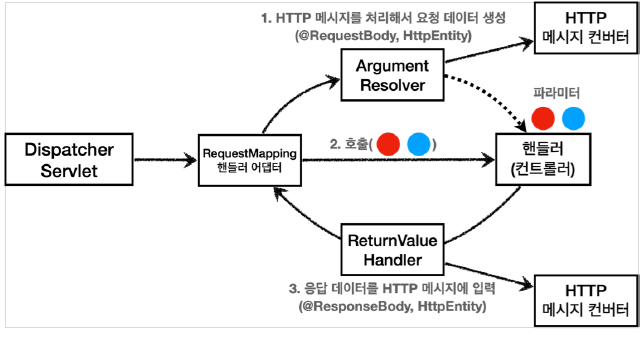

## 스프링 MVC - 기본 기능

---

### HTTP 메서드 매핑

```java
@RequestMapping(value = "/mapping-get-v1", method = RequestMethod.GET)
public String mappingGetV1(){
        log.info("mappingGetV1");
        return"ok";
        }
```

`method = RequestMethod.GET`로 설정되어 있기때문에 POST로 요청하면 MVC는 HTTP 405를 반환한다.

### HTTP 메서드 매핑 축약

```java
/**
 * 편리한 축약 애노테이션
 * @GetMapping
 * @PostMapping
 * @PutMapping
 * @DeleteMapping
 * @PatchMapping
 */
@GetMapping("/mapping-get-v2")
public String mappingGetV2(){
        log.info("mapping-get-v2");
        return"ok";
        }
```

`@RequestMapping` 대신 `@GetMapping`등으로 바꾸어서 지정할 수 있다.

### PathVariable(경로 변수) 사용

```java
    /**
 * PathVariable 사용
 * 변수명이 같으면 생략 가능
 * @PathVariable("userId") String userId -> @PathVariable String userId
 */
@GetMapping("/mapping/{userId}")
public String mappingPath(@PathVariable("userId") String data){
        log.info("mappingPath userId={}",data);
        return"ok";
        }
```

최근 HTTP API는 다음과 같이 리소스 경로에 식별자를 넣는 스타일을 선호한다.

+ `/mapping/userA`
+ `/users/1`

+ `@RequestMapping`은 URL 경로를 템플릿화 할 수 있는데, `@PathVariable`을 사용하면 매칭 되는 부분을 편리하게 조회할 수 있다.
+ `@PathVariable`의 이름과 파라미터 이름이 같으면 생략할 수 있다.

### PathVariable 사용 - 다중

```java
    @GetMapping("mapping/users/{userId}/orders/{orderId}")
public String mappingPath(@PathVariable String userId,@PathVariable Long orderId){
        log.info("mappingPath userId={}, orderId={}",userId,orderId);
        return"ok";
        }
```

위의 매핑 이외에도 여러 조건에 따라서 매핑을 할 수 있다.

```java
    /**
 * 파라미터로 추가 매핑
 * params="mode",
 * params="!mode"
 * params="mode=debug"
 * params="mode!=debug" (! = )
 * params = {"mode=debug","data=good"}
 */
@GetMapping(value = "/mapping-param", params = "mode=debug")
public String mappingParam(){
        log.info("mappingParam");
        return"ok";
        }

/**
 * 특정 헤더로 추가 매핑
 * headers="mode",
 * headers="!mode"
 * headers="mode=debug"
 * headers="mode!=debug" (! = )
 */
@GetMapping(value = "/mapping-header", headers = "mode=debug")
public String mappingHeader(){
        log.info("mappingHeader");
        return"ok";
        }


/**
 * Content-Type 헤더 기반 추가 매핑 Media Type
 * consumes="application/json"
 * consumes="!application/json"
 * consumes="application/*"
 * consumes="*\/*"
 * MediaType.APPLICATION_JSON_VALUE
 */
@PostMapping(value = "/mapping-consume", consumes = "application/json")
public String mappingConsumes(){
        log.info("mappingConsumes");
        return"ok";
        }

/**
 * Accept 헤더 기반 Media Type
 * produces = "text/html"
 * produces = "!text/html"
 * produces = "text/*"
 * produces = "*\/*"
 */
@PostMapping(value = "/mapping-produce", produces = "text/html")
public String mappingProduces(){
        log.info("mappingProduces");
        return"ok";
        }
```

---

## 요청 매핑 - API 예시

회원 관리를 HTTP API로 만든다고 생각하고 매핑을 어떻게 하는지 알아보자

---

### 회원관리 API

+ 회원 목록 조회: GET     `/users`
+ 회원 등록    : POST    `/users`
+ 회원 조회    : GET     `/users/{userId}`
+ 회원 수정    : PATCH   `/users/{userId}`
+ 회원 삭제    : DELETE  `/users/{userId}`

basic/requestmapping/MappingClassController

```java

@RestController
@RequestMapping("mapping/users")
public class MappingClassController {

    @GetMapping
    public String user() {
        return "get users";
    }

    @PostMapping
    public String addUser() {
        return "post user";
    }

    @GetMapping("/{userId}")
    public String findUser(@PathVariable String userId) {
        return "get userId=" + userId;
    }

    @PatchMapping("/{userId}")
    public String updateUser(@PathVariable String userId) {
        return "update userId=" + userId;
    }

    @DeleteMapping("/{userId}")
    public String deleteUser(@PathVariable String userId) {
        return "delete userId=" + userId;
    }
}
```

---

## HTTP 요청 - 기본, 헤더 조회

애노테이션 기반의 스프링 컨트롤러는 다양한 파라미터를 지원한다.

HTTP 헤더 정보를 조회하는 방법을 알아본다.

---

basic/request/RequestHeaderController

```java

@Slf4j
@RestController
public class RequestHeaderController {

    @RequestMapping("/headers")
    public String headers(HttpServletRequest request,
                          HttpServletResponse response,
                          HttpMethod httpMethod,
                          Locale locale,
                          @RequestHeader MultiValueMap<String, String> headerMap,
                          @RequestHeader("host") String host,
                          @CookieValue(value = "myCookie", required = false) String cookie) {
        log.info("request={}", request);
        log.info("response={}", response);
        log.info("httpMethod={}", httpMethod);
        log.info("locale={}", locale);
        log.info("headerMap={}", headerMap);
        log.info("header host={}", host);
        log.info("myCookie={}", cookie);
        return "ok";
    }
}

```

`HttpMethod` : HTTP 메서드를 조회
`@RequestHeader MultiValueMap<String, String> headerMap`: 모든 HTTP 헤더를 MultiValueMap 형식으로 조회한다.
`@RequestHeader("host") String host`: 특정 HTTP 헤더를 조회한다.

`MutltiValueMap`

+ Map과 유사하지만 하나의 키에 여러 값을 받을 수 있다.
+ HTTP header, HTTP 쿼리 파라미터와 같이 하나의 키에 여러 값을 받을 때 사용한다.
    + **keyA=value1&keyA=value2**

---

## HTTP 요청 파라미터 - 쿼리 파라미터, HTML Form

클라이언트에서 서버로 요청 데이터를 전달할 때는 주로 3가지 방법을 사용한다.

**GET - 쿼리 파라미터**

+ /url?**username=hello&age=20**
+ 메시지 바디 없이, URL의 쿼리 파라미터에 데이터를 포함해서 전달

**POST - HTML Form**

+ content-type: application/x-www-form-urlencoded
+ 메시지 바디에 쿼리 파라미터 형식으로 전달 username=hello&age=20

**HTTP message body**에 데이터를 직점 담아서 요청

+ HTTP API에서 주로 사용
+ 데이터 형식으로 주로 JSON 사용

---

### 요청 파라미터 - 쿼리 파라미터, HTML Form

`HttpServletRequest`의 `request.getParameter()`를 사용하면 조회할 수 있다.

GET 쿼리 파라미터 전송 방식이든, POST HTML Form 전송 방식이든 형식이 같기때문에 요청 파라미터(request parameter)조회 라고 한다.

basic/request/RequestParamController

```java

@Slf4j
@Controller
public class RequestParamController {

    @RequestMapping("/request-param-v1")
    public void requestParamV1(HttpServletRequest request, HttpServletResponse response) throws IOException {
        String username = request.getParameter("username");
        int age = Integer.parseInt(request.getParameter("age"));
        log.info("username={}, age={}", username, age);

        response.getWriter().write("ok");
    }
}
```

`request.getParameter()`를 사용해서 HttpServletRequest가 제공하는 방식으로 조회한다.

---

## HTTP 요청 파라미터 - @RequestParam

스프링이 제공하는 `@RequestParam`을 사용하면 매우 편리하게 조회가 가능하다.

---

```java
    @RequestMapping("/request-param-v2")
@ResponseBody
public String requestParamV2(@RequestParam("username") String memberName,
@RequestParam("age") int memberAge){
        log.info("username={}, age={}",memberName,memberAge);

        return"ok";
        }
```

`@RequestParam`: 파라미터 이름으로 바인딩
`@ResponseBody`: View 조회를 무시하고, HTTP message body에 직접 해당 내용을 입력한다.

**@RequestParam`의 `name(value)` 속성이 파라미터 이름으로 사용된다.**

@RequestParam("username") String memberName

-> String memberName = request.getParameter("username")과 같다.

```java
    @RequestMapping("/request-param-v3")
@ResponseBody
public String requestParamV3(@RequestParam String username,
@RequestParam int age){
        log.info("username={}, age={}",username,age);

        return"ok";
        }
```

HTTP 요청 파라미터 이름이 변수 이름과 같으면 (name="xx") 생략 가능하다.

```java
    @RequestMapping("/request-param-v4")
@ResponseBody
public String requestParamV4(String username,int age){
        log.info("username={}, age={}",username,age);

        return"ok";
        }
```

`String`, `int`, `Integer`같은 단순 타입이면 @RequestParam도 생략 가능하다.

> 주의
>
> `@RequestParam` 애노테이션을 생략하면 스프링 MVC 내부에서 `required=false`를 적용한다.

```java
    @RequestMapping("/request-param-required")
@ResponseBody
public String requestParamRequired(
@RequestParam(required = true) String username,
@RequestParam(required = false) Integer age){
        log.info("username={}, age={}",username,age);

        return"ok";
        }
```

`@RequestParam(required = )`

+ 파리미터 필수 여부
+ 기본값은 true이다.

**주의! - 파라미터 이름만 사용**

+ `request-param?username=` 처럼 파라미터 이름만 있고 값이 없는 경우엔 빈 문자로 통과되어버린다.

**주의! - 기본형(primitive)에 null 입력**

+ int형으로 받을때 파라미터 값이 없으면 null을 넣을수 없으므로 예외가 발생한다.
+ `null`을 받을 수 있는 `Integer`타입으로 변경하거나, `defaultValue`를 사용한다.

```java
    @RequestMapping("/request-param-default")
@ResponseBody
public String requestParamDefault(
@RequestParam(required = true, defaultValue = "guest") String username,
@RequestParam(required = false, defaultValue = "-1") int age){
        log.info("username={}, age={}",username,age);

        return"ok";
        }
```

파라미터 값이 없는 경우 `defaultValue`를 사용하면 기본값을 적용할 수 있다.

`defaultValue`는 빈 문자의 경우에도 설정한 기본 값이 적용된다.

`/request-param?username=`의 경우에도 defaultValue 적용

```java
    @RequestMapping("/request-param-map")
@ResponseBody
public String requestParamMap(@RequestParam Map<String, Object> paramMap){
        log.info("username={}, age={}",paramMap.get("username"),paramMap.get("age"));

        return"ok";
        }

@RequestMapping("/request-param-multivaluemap")
@ResponseBody
public String requestParamMultiValueMap(@RequestParam MultiValueMap<String, Object> paramMap){
        log.info("username={}, age={}",paramMap.get("username"),paramMap.get("age"));
        log.info("username1={},username2={}",paramMap.get("username").get(0),paramMap.get("username").get(1));
        return"ok";
        }
```

파라미터를 Map,MultiValueMap으로 조회할 수 있다.

파라미터의 값이 1개가 확실하다면 `Map`을 사용해도 되지만, 그렇지 않다면 `MultiValueMap`을 사용하자.

---

## HTTP 요청 파라미터 - @ModelAttribute

실제 개발을 하면 요청 파라미터를 받아서 필요한 객체를 만들고 그 객체에 값을 넣어주어야 한다.

```java
@RequestParam String username;
@RequestParam int age;

        HelloData data=new HelloData();
        data.setUsername(username);
        data.setAge(age);
```

스프링은 위의 과정을 자동화 해주는 `@ModelAttribute` 를 제공한다.


---

basic/HelloData

```java

@Data
public class HelloData {
    private String username;
    private int age;
}
```

`@Data` : `@Getter`, `@Setter`, `@ToString`, `@EqualsAndHashCode`, `@RequiredArgsConstructor`를 자동으로 적용해준다.

```java
    @RequestMapping("/model-attribute-v1")
@ResponseBody
public String modelAttributeV1(@ModelAttribute HelloData helloData){
        log.info("username={}, age={}",helloData.getUsername(),helloData.getAge());

        return"ok";
        }
```

스프링 MVC는 `@ModelAttribute`가 있으면 다음과 같이 동작한다.

+ `HelloData` 객체를 생성
+ 요청 파라미터의 이름으로 `HelloData` 객체의 프로퍼티를 찾는다. 해당 프로퍼티의 setter를 호출해서 파라미터의 값을 입력(바인딩)한다.
+ 파라미터 이름이 username이면 setUsername()을 찾아서 호출하고 값을 바인딩한다.

**프로퍼티**
객체에 `getUsername`,`setUsername` 메서드가 있으면 이 객체는 `username`이라는 프로퍼티를 가지고 있다.

```java
    @RequestMapping("/model-attribute-v2")
@ResponseBody
public String modelAttributeV2(HelloData helloData){
        log.info("username={}, age={}",helloData.getUsername(),helloData.getAge());

        return"ok";
        }
```

`@ModelAttribute`는 생략할 수 있다.

`@RequestParam`: String, int, Integer 같은 단순 타입
`@ModelAttribute`: 나머지

---

## HTTP 요청 메시지 - 단순 텍스트

HTTP message body에 데이터를 직접 담아서 요청하는 경우

요청 파라미터와 다르게 HTTP 메시지 바디를 통해 데이터가 직접 데이터가 넘어오는 경우는 `@RequestParam`, `@ModelAttribute`를 사용할 수 없다.

HTTP 메시지 바디의 데이터를 `InputStream`을 사용해서 직접 읽을 수 있다.


---


basic/request/RequestBodyStringController

```java
    @PostMapping("/request-body-string-v1")
public void requestBodyString(HttpServletRequest request,HttpServletResponse response)throws IOException{
        ServletInputStream inputStream=request.getInputStream();
        String messageBody=StreamUtils.copyToString(inputStream,StandardCharsets.UTF_8);

        log.info("messageBody={}",messageBody);

        response.getWriter().write("ok");
        }
```

```java
    @PostMapping("/request-body-string-v2")
public void requestBodyStringV2(InputStream inputStream,Writer responseWriter)throws IOException{
        String messageBody=StreamUtils.copyToString(inputStream,StandardCharsets.UTF_8);

        log.info("messageBody={}",messageBody);

        responseWriter.write("ok");
        }
```

+ InputStream(Reader): HTTP 요청 메시지 바디의 내용을 직접 조회
+ OutputStream(Writer): HTTP 응답 메시지의 바디에 직접 결과 출력

```java
    @PostMapping("/request-body-string-v3")
public HttpEntity<String> requestBodyStringV3(HttpEntity<String> httpEntity)throws IOException{

        String messageBody=httpEntity.getBody();

        log.info("messageBody={}",messageBody);

        return new HttpEntity<>("ok");
        }
```

HttpEntity: HTTP header, body 정보를 편리하게 조회

HttpEntity는 응답에도 사용 가능하다.

HttpEntity를 상속받은 객체들은 다음과 같은 기능을 제공한다.

+ RequestEntity: HttpMethod, url, 요청에서 사용
+ ResponseEntity: HTTP 상태 코드 설정 가능

```java
    @ResponseBody
@PostMapping("/request-body-string-v4")
public String requestBodyStringV4(@RequestBody String messageBody)throws IOException{

        log.info("messageBody={}",messageBody);

        return"ok";
        }
```

**@RequestBody**

+ `@RequestBody`를 사용하면 HTTP 메시지 바디 정보를 편리하게 조회할 수 있다. 헤더 정보가 필요하다면 `HttpEntity`를 사용하거나 `@RequestHeader`를 사용하면 된다.
+ `@ResponseBody`를 사용하면 응답 결과를 HTTP 메시지 바디에 직접 담아서 전달할 수 있다. 이경우엔 view를 사용하지 않는다.

---

## HTTP 요청 메시지 - JSON

---

```java
    @PostMapping("/request-body-json-v1")
public void requestBodyJsonV1(HttpServletRequest request,HttpServletResponse response)throws IOException{

        ServletInputStream inputStream=request.getInputStream();
        String messageBody=StreamUtils.copyToString(inputStream,StandardCharsets.UTF_8);

        log.info("messageBody={}",messageBody);
        HelloData helloData=objectMapper.readValue(messageBody,HelloData.class);
        log.info("username={}, age={}",helloData.getUsername(),helloData.getAge());

        response.getWriter().write("ok");
        }
```

서블릿을 사용해서 HTTP 메시지 바디에서 데이터를 읽어와 문자로 변환한다.

문자로 된 JSON 데이터를 Jackson 라이브러리인 objectMapper를 이용해 자바 객체로 변환한다.

```java
    @ResponseBody
@PostMapping("/request-body-json-v2")
public String requestBodyJsonV2(@RequestBody String messageBody)throws IOException{

        log.info("messageBody={}",messageBody);
        HelloData helloData=objectMapper.readValue(messageBody,HelloData.class);
        log.info("username={}, age={}",helloData.getUsername(),helloData.getAge());

        return"ok";
        }
```

문자로 된 JSON 데이터인 messageBody를 obejctMapper를 이용해 자바 객체로 변환한다.

```java
    @ResponseBody
@PostMapping("/request-body-json-v3")
public String requestBodyJsonV3(@RequestBody HelloData data){

        log.info("username={}, age={}",data.getUsername(),data.getAge());
        return"ok";
        }
```

`@RequestBody HelloData data`를 사용하면 객체에 저장할 수 있다.

@RequestBody는 생략이 불가능하다.

생략하면 @ModelAttribute가 적용돼면서 프로퍼티를 찾아서 적용하게 된다.

```java
    @ResponseBody
@PostMapping("/request-body-json-v4")
public String requestBodyJsonV4(HttpEntity<HelloData> httpEntity){

        HelloData data=httpEntity.getBody();
        log.info("username={}, age={}",data.getUsername(),data.getAge());
        return"ok";
        }
```

HttpEntity 적용

```java
    @ResponseBody
@PostMapping("/request-body-json-v5")
public HelloData requestBodyJsonV5(@RequestBody HelloData data){

        log.info("username={}, age={}",data.getUsername(),data.getAge());
        return data;
        }
```

`@ResponseBody`: 응답의 경우 `@ResponseBody`를 사용하여 객체를 return하면 HTTP 메시지 바디에 직접 넣어줄 수 있다.

`@RequestBody` : JSON 요청 -> HTTP 메시지 컨버터 -> 객체
`@ResponseBody` : 객체 -> HTTP 메시지 컨버터 -> JSON 응답

---

## HTTP 응답 - 정적 리소스, 뷰 템플릿

스프링에서 응답 데이터를 만드는 방법은 크게 3가지이다.

+ 정적 리소스
+ 뷰 템플릿 사용
+ HTTP 메시지 사용
    + HTTP 메시지 바디에 JSON 같은 형식으로 데이터를 실어 보낸다.

---

### 정적 리소스

스프링 부트는 클래스패스의 다음 디렉토리에 있는 정적 리소스를 제공한다.

`/static`, `/public`, `/resources`, `META-INF/resources`

`src/main/resources`는 리소스를 보관하는곳, 클래스 패스의 시작 경로

따라서 다음 디렉토리에 리소스를 넣어두면 스프링 부트가 정적 리소스로 서비스를 제공한다.

**정적 리소스 경로**

`src/main/resources/static`

`src/main/resources/static/basic/hello-form.html` 파일이 있으면

`http://locatlhost:8080/basic/hello-form.html` 으로 실행하면 된다.

**뷰 템플릿**

뷰 템플릿 경로
`src/main/resources/templates`

basic/response/ResponseViewController

```java

@Controller
public class ResponseViewController {
    @RequestMapping("/response-view-v1")
    public ModelAndView responseViewV1() {
        ModelAndView mav = new ModelAndView("response/hello");
        mav.addObject("data", "hello!");

        return mav;
    }
}
```

ModelAndView로 반환하는 경우 뷰의 이름을 지정해주고 addObject()로 데이터를 넣은 뒤 반환 해준다.

```java

@Controller
public class ResponseViewController {
    
    @RequestMapping("/response-view-v2")
    public String responseViewV2(Model model) {
        model.addAttribute("data", "hello!");

        return "response/hello";
    }
}
```

반환 타입이 String인 경우 - View or HTTP

`@ResponseBody`가 없으면 `response/hello`로 뷰 리졸버가 실행되어 뷰를 차조 렌더링 한다.
+ 위의 경우엔 "response/hello" 로 반환하면 뷰 템플릿이 렌더링 되어 보여진다.

`@ResponseBody`가 있으면 뷰 리졸버를 실행하지 않고 HTTP 메시지 바디에 직접 `response/hello`라는 문자가 입력된다.


```java
@Controller
public class ResponseViewController {

    @RequestMapping("/response/hello")
    public void responseViewV3(Model model){
        model.addAttribute("data","hello!");
    }
}

```

반환 타입이 void인 경우

`@Controller`를 사용하고 `HttpServletResponse`,`OutputStream(Writer)`같은 HTTP 메시지 바디를 처리하는 파라미터가 없으면 URL을 참고하여 논리 뷰 이름으로 사용한다.

+ 요청 URL: `/response/hello`
+ 실행: `templates/response/hello.html`

이 방식은 명시성이 떨어지고 권장하지 않는다.


HTTP 메시지

`@ResponseBody`,`HttpEntity`를 사용하면 뷰 템플릿을 사용하지 않고 HTTP 메시지 바디에 직접 응답 데이터를 출력한다.

---

## HTTP 응답 - HTTP API, 메시지 바디에 직접 입력

---

basic/response/ResponseBodyController

```java
@Slf4j
@Controller
public class ResponseBodyController {

    @GetMapping("/response-body-string-v1")
    public void responseBodyV1(HttpServletResponse response) throws IOException{
        response.getWriter().write("ok");
    }

    @GetMapping("/response-body-string-v2")
    public ResponseEntity<String> responseBodyV2() {
        return new ResponseEntity<>("ok", HttpStatus.OK);
    }

    @ResponseBody
    @GetMapping("/response-body-string-v3")
    public String responseBodyV3() {
        return "ok";
    }

    @GetMapping("/response-body-json-v1")
    public ResponseEntity<HelloData> responseBodyJsonV1(){
        HelloData helloData = new HelloData();
        helloData.setUsername("userA");
        helloData.setAge(20);

        return new ResponseEntity<>(helloData,HttpStatus.OK);
    }

    @ResponseStatus(HttpStatus.OK)
    @ResponseBody
    @GetMapping("/response-body-json-v2")
    public HelloData responseBodyJsonV2(){
        HelloData helloData = new HelloData();
        helloData.setUsername("userA");
        helloData.setAge(20);

        return helloData;
    }
}
```


### responseBodyV1

서블릿을 직접 다룰 때 처럼 HttpServletResponse 를 통해 HTTP 메시지에 응답 메시지를 전달한다.

### responseBodyV2

ResponseEntity는 HttpEntity를 상속받는다. 응답 코드를 같이 설정해주고 전달한다.

### responseBodyV3

`@ResponseBody`를 사용하면 view를 사용하지 않고, HTTP 메시지 컨버터를 통해서 HTTP 메시지를 직접 입력할 수 있다.

### responseBodyJsonV1

`ResponseEntity`를 반환한다. HTTP 메시지 컨버터를 통해 JSON 형식으로 반환된다.

### responseBodyJsonV2

`ResponseEntity`는 HTTP 응답 코드를 설정할 수 있는데, `@ResponseBody`애노테이션을 사용하면 설정하기 까다롭다.

`@ResponseStatus(HttpStatus.OK)`처럼 애노테이션을 사용하여 설정할 수 있다.

### @RestController

`@Controller` 대신 `@RestController`를 사용하면 해당 컨트롤러에 모두 `@ResponseBody`가 적용된다.

----

## HTTP 메시지 컨버터

뷰 템플릿으로 HTML을 생성해서 응답하는 것이 아니라, API 처럼 JSON 데이터를 HTTP 메시지 바디에 직접 읽거나 쓰는 경우 HTTP 메시지 컨버터를 사용하면 편리하다.


**@ResponseBody 사용 원리**



+ `@ResponseBody` 사용
  + HTTP BODY에 문자 내굥을 직접 변환
  + `viewResolver`가 아닌 `HttpMessageConverter` 동작
  

> 응답의 경우 클라이언트의 HTTP Accept 헤더와 서버의 컨트롤러 반환 타입 정보 둘을 조합해서 `HttpMessageConverter`가 선택된다.


스프링 MVC는 다음의 경우 HTTP 메시지 컨버터를 적용한다.

+ HTTP 요청 : `@RequestBody`,`HttpEntity(RequestEntity)`
+ HTTP 응답 : `@ResponseBody`, `HttpEntity(ResponseEntity)`

HTTP 메시지 컨버터는 요청, 응답에 둘 다 사용된다.

+ `canRead()`,`canWrite()`: 메시지 컨버터가 해당 클래스, 미디어타입을 지원하는지 체크
+ `read()`, `write()`: 메시지 컨버터를 통해서 메시지를 읽고 쓰는 기능

**스프링 부트 기본 메시지 컨버터**

```text

0 = ByteArrayHttpMessageConverter

1 = StringHttpMessageConverter

2 = MappingJackson2HttpMessageConverter

```

스프링 부트는 다양한 메시지 컨버터를 제공하고, 대상 클래스 타입과 미디어 타입을 체크해서 사용 여부를 결정한다.


+ `ByteArrayHttpMessageConverter`: `byte[]` 데이터를 처리
  + 클래스 타입: `byte[]`, 미디어 타입: `*/*`
  + 요청 예) `@RequestBody byte[] data`
  + 응답 예) `@ResponseBody return byte[]`, 쓰기 미디어타입 `application/ontet-stream`
+ `StringHttpMessageConverter`: `String` 문자로 데이터 처리
  + 클래스 타입: `String`, 미디어 타입: `*/*`
  + 요청 예) `@RequestBody String data`
  + 응답 예) `@ResponseBody return "ok"` 쓰기 미디어타입 `text/plain`
+ `MappingJackson2HttpMessageConverter`: `application/json`
  + 클래스 타입: 객체 또는 `HashMap`, 미디어 타입: `application/json` 관련
  + 요청 예) `@RequestBody HelloData data`
  + 응답 예) `@ResponseBody return helloData` 쓰기 미디어타입: `application/json`

### StringHttpMessageConverter

```text
content-type: application/json

@RequestMapping
void hello(@RequestBody String data){}
```


### MappingJackson2HttpMessageConverter

```text
content-type: application/json

@RequestMapping
void hello(@RequestBody HelloData data){}
```


### HTTP 요청 데이터 읽기

+ HTTP 요청이 오고, 컨트롤러에서 `@RequestBody`, `HttpEntity` 파라미터를 사용한다.
+ 메시지 컨버터가 메시지를 읽을 수 있는지 `canRead()`를 호출
  + 대상 클래스 타입을 지원하는가
    + `@RequestBody`의 대상 클래스 (`byte[]`, `String`, `HelloData`)
  + HTTP 요청의 Content-Type 미디어 타입을 지원하는가.
    + `text/plain`, `application/json`, `*/*`
+ `canRead()` 조건을 만족하면 `read()`를 호출하여 객체를 생성하고 반환한다.


### HTTP 응답 데이터 생성

+ 컨트롤러에서 `@ResponsBody`, `HttpEntity`로 값이 반환된다.
+ 메시지 컨버터가 메시지를 쓸 수 있는지 확인하기 위해 `canWrite()`를 호출
  + 대상 클래스 타입을 지원하는가
    + return의 대상 클래스 (`byte[], `String`, `HelloData`)
  + HTTP 요청의 Accept 미디어 타입을 지원하는가.
    + `text/plain`, `application/json`, `*/*`
+ `canWrite()` 조건을 만족하면 `write()`를 호출해서 HTTP 응답 메시지 바디에 데이터를 생성한다.

---

## 요청 매핑 핸들러 어댑터 구조

HTTP 메시지 컨버터는 스프링 MVC 어디쯤에서 사용되는 것일까?



위 그림에서는 보이지 않는다.

정답은 `@RequestMapping`을 처리하는 핸들러 어댑터인 `RequestMappingHandlerAdapter`에 있다.

---

### RequestMappingHandlerAdapter 동작방식



**ArgumentResolver**

애노테이션 기반의 컨트롤러는 매우 다양한 파라미터를 사용할 수 있다.

`HttpServletRequest`, `Model`, `@RequsetParam`, `@ModelAttribute`... 등 매우 큰 유연함을 보여준다.

애노테이션 기반의 컨트롤러를 처리하는 `RequestMappingHandlerAdapter`는 `ArgumentResolver`를 호출하고 컨트롤러가 필요한 파라미터의 값(객체)를 생성하고 컨트롤러를 호출하면서 값을 넘겨준다.


**ReturnValueHandler**

`ArgumentResolver`와 비슷한데, 응답 값을 변환하고 처리한다.

컨트롤러에서 String으로 뷰 이름을 반환해도 동작하는 이유가 `ReturnValueHandler` 덕분이다.


### HTTP 메시지 컨버터



HTTP 메시지 컨버터를 사용하는 `@RequestBody`도 컨트롤러가 필요로 하는 파라미터의 값에 사용된다.

요청의 경우 `@RequestBody`를 처리하는 `ArgumentResolver`가 있고 `HttpEntity`를 처리하는 `ArgumentResolver`가 있다. 이 `ArgumentResolver`들이 HTTP 메시지 컨버터를 사용해서 필요한 객체를 생성하는 것이다.

응답의 경우 `@ResponseBody`와 `HttpEntity`를 처리하는 `ReturnValueHandler`가 있다. 여기서 HTTP 메시지 컨버터를 호출해서 응답 결과를 만든다.

