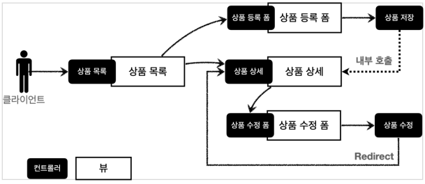
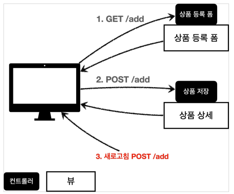
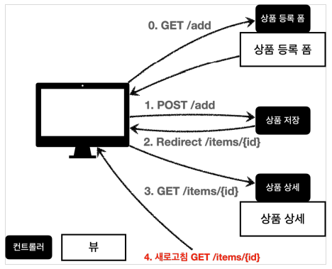

# 웹 페이지 만들기

---

## 요구사항 분석

### 상품 도메인 모델

+ 상품 ID
+ 상품명
+ 가격
+ 수량


### 상품 관리 기능

+ 상품 목록
+ 상품 상세
+ 상품 등록
+ 상품 수정



domain/item/Item

```java
@Data
public class Item {

    private Long id;
    private String itemName;
    private Integer price;
    private Integer quantity;

    public Item() {
    }

    public Item(String itemName, Integer price, Integer quantity) {
        this.itemName = itemName;
        this.price = price;
        this.quantity = quantity;
    }
}
```


domain/item/ItemRepository

```java
@Repository
public class ItemRepository {
    private static final Map<Long, Item> store = new HashMap<>(); //static 사용
    private static long sequence = 0L; //static 사용

    public Item save(Item item) {
        item.setId(++sequence);
        store.put(item.getId(), item);
        return item;
    }

    public Item findById(Long id) {
        return store.get(id);
    }

    public List<Item> findAll() {
        return new ArrayList<>(store.values());
    }

    public void update(Long itemId, Item updateParam) {
        Item findItem = findById(itemId);
        findItem.setItemName(updateParam.getItemName());
        findItem.setPrice(updateParam.getPrice());
        findItem.setQuantity(updateParam.getQuantity());
    }

    public void clearStore() {
        store.clear();
    }
}
```

---

## 상품 서비스 HTMl

resources/static/css에 bootstrap.min.css를 추가한다.


static/html/addForm.html

```html
<!DOCTYPE HTML>
<html>
<head>
    <meta charset="utf-8">
    <link href="../css/bootstrap.min.css" rel="stylesheet">
    <style>
        .container {
            max-width: 560px;
        }
    </style>
</head>
<body>
<div class="container">
    <div class="py-5 text-center">
        <h2>상품 등록 폼</h2>
    </div>
    <h4 class="mb-3">상품 입력</h4>
    <form action="item.html" method="post">
        <div>
            <label for="itemName">상품명</label>
            <input type="text" id="itemName" name="itemName" class="form-control" placeholder="이름을 입력하세요">
        </div>
        <div>
            <label for="price">가격</label>
            <input type="text" id="price" name="price" class="form-control"
                   placeholder="가격을 입력하세요">
        </div>
        <div>
            <label for="quantity">수량</label>
            <input type="text" id="quantity" name="quantity" class="form-control" placeholder="수량을 입력하세요">
        </div>
        <hr class="my-4">
        <div class="row">
            <div class="col">
                <button class="w-100 btn btn-primary btn-lg" type="submit">상품 등록
                </button>
            </div>
            <div class="col">
                <button class="w-100 btn btn-secondary btn-lg"
                        onclick="location.href='items.html'" type="button">취소
                </button>
            </div>
        </div>
    </form>
</div> <!-- /container -->
</body>
</html>
```


static/html/item.html

```html
<!DOCTYPE HTML>
<html>
<head>
    <meta charset="utf-8">
    <link href="../css/bootstrap.min.css" rel="stylesheet">
    <style>
        .container {
            max-width: 560px;
        }
    </style>
</head>
<body>
<div class="container">
    <div class="py-5 text-center">
        <h2>상품 상세</h2>
    </div>
    <div>
        <label for="itemId">상품 ID</label>
        <input type="text" id="itemId" name="itemId" class="form-control"
               value="1" readonly>
    </div>
    <div>
        <label for="itemName">상품명</label>
        <input type="text" id="itemName" name="itemName" class="form-control"
               value="상품A" readonly>
    </div>
    <div>
        <label for="price">가격</label>
        <input type="text" id="price" name="price" class="form-control"
               value="10000" readonly>
    </div>
    <div>
        <label for="quantity">수량</label>
        <input type="text" id="quantity" name="quantity" class="form-control"
               value="10" readonly>
    </div>
    <hr class="my-4">
    <div class="row">
        <div class="col">
            <button class="w-100 btn btn-primary btn-lg"
                    onclick="location.href='editForm.html'" type="button">상품 수정
            </button>
        </div>
        <div class="col">
            <button class="w-100 btn btn-secondary btn-lg"
                    onclick="location.href='items.html'" type="button">목록으로
            </button>
        </div>
    </div>
</div> <!-- /container -->
</body>
</html>
```

static/html/items.html
```html
<!DOCTYPE HTML>
<html>
<head>
    <meta charset="utf-8">
    <link href="../css/bootstrap.min.css" rel="stylesheet">
</head>
<body>
<div class="container" style="max-width: 600px">
    <div class="py-5 text-center">
        <h2>상품 목록</h2>
    </div>
    <div class="row">
        <div class="col">
            <button class="btn btn-primary float-end"
                    onclick="location.href='addForm.html'" type="button">상품 등록
            </button>
        </div>
    </div>
    <hr class="my-4">
    <div>
        <table class="table">
            <thead>
            <tr>
                <th>ID</th>
                <th>상품명</th>
                <th>가격</th>
                <th>수량</th>
            </tr>
            </thead>
            <tbody>
            <tr>
                <td><a href="item.html">1</a></td>
                <td><a href="item.html">테스트 상품1</a></td>
                <td>10000</td>
                <td>10</td>
            </tr>
            <tr>
                <td><a href="item.html">2</a></td>
                <td><a href="item.html">테스트 상품2</a></td>
                <td>20000</td>
                <td>20</td>
            </tr>
            </tbody>
        </table>
    </div>
</div> <!-- /container -->
</body>
</html>
```

static/html/editForm.html

```html
<!DOCTYPE HTML>
<html>
<head>
    <meta charset="utf-8">
    <link href="../css/bootstrap.min.css" rel="stylesheet">
    <style>
        .container {
            max-width: 560px;
        }
    </style>
</head>
<body>
<div class="container">
    <div class="py-5 text-center">
        <h2>상품 수정 폼</h2>
    </div>
    <form action="item.html" method="post">
        <div>
            <label for="id">상품 ID</label>
            <input type="text" id="id" name="id" class="form-control" value="1"
                   readonly>
        </div>
        <div>
            <label for="itemName">상품명</label>
            <input type="text" id="itemName" name="itemName" class="form-control" value="상품A">
        </div>
        <div>
            <label for="price">가격</label>
            <input type="text" id="price" name="price" class="form-control"
                   value="10000">
        </div>
        <div>
            <label for="quantity">수량</label>
            <input type="text" id="quantity" name="quantity" class="form-control" value="10">
        </div>
        <hr class="my-4">
        <div class="row">
            <div class="col">
                <button class="w-100 btn btn-primary btn-lg" type="submit">저장
                </button>
            </div>
            <div class="col">
                <button class="w-100 btn btn-secondary btn-lg"
                        onclick="location.href='item.html'" type="button">취소
                </button>
            </div>
        </div>
    </form>
</div> <!-- /container -->
</body>
</html>
```

/resources/static에 넣어두었기 때문에 스프링 부트가 정적 리소스를 제공한다.

> 정적 리소스가 공개되는 /resources/static 폴더에 html을 넣어두면, 실제 서비스에서도 공개되기 때문에 공개할 필요가 없는 html을 두는 것은 주의해야 한다.

---

## 상품 목록 - 타임리프


templates/basic/items.html

```html
<!DOCTYPE HTML>
<html xmlns:th="http://www.thymeleaf.org">
<head>
    <meta charset="utf-8">
    <link th:href="@{/css/bootstrap.min.css}"
            href="../css/bootstrap.min.css" rel="stylesheet">
</head>
<body>
<div class="container" style="max-width: 600px">
    <div class="py-5 text-center">
        <h2>상품 목록</h2>
    </div>
    <div class="row">
        <div class="col">
            <button class="btn btn-primary float-end"
                    onclick="location.href='addForm.html'"
                    th:onclick="|location.href='@{/basic/items/add}'|"
                    type="button">상품 등록</button>
        </div>
    </div>
    <hr class="my-4">
    <div>
        <table class="table">
            <thead>
            <tr>
                <th>ID</th>
                <th>상품명</th>
                <th>가격</th>
                <th>수량</th>
            </tr>
            </thead>
            <tbody>
            <tr th:each="item : ${items}">
                <td><a href="item.html" th:href="@{/basic/items/{itemId}(itemId=${item.id})}" th:text="${item.id}">회원id</a></td>
                <td><a href="item.html" th:href="@{/basic/items/{itemId}(itemId=${item.id})}" th:text="${item.itemName}">상품명</a></td>
                <td th:text="${item.price}">10000</td>
                <td th:text="${item.quantity}">10</td>
            </tr>
            </tbody>
        </table>
    </div>
</div> <!-- /container -->
</body>
</html>
```

**타임리프 사용 선언**

`<html xmlns:th="http://www.thymeleaf.org">`

**속성 변경**

+ 타임리프 뷰 템플릿을 거치게 되면 원래 값을 `th:xxx`값으로 변경한다. 값이 없으면 새로 생성한다.
+ HTML을 그대로 볼 때는 원래 속성대로 사용되고 템플릿을 거치면 `th:xxx`의 값이 대체되면서 동적으로 변경 한다.

**URL 링크 표현식 - @{...}**

+ 타임리프는 URL 링크를 사용하는 경우 `@{...}`을 사용한다.
  + `th:href="@{/css/bootstrap.min.css}"`

    
**URL 링크 표현식2 - @{...}**

+ 경로를 템프릿처럼 편하게 사용할 수 있다.
  + `th:href="@{/basic/items/{itemId}(itemId=${item.id})}`

**리터럴 대체 - |...|**

+ 타임리프는 문자와 표현식 등은 분리되어 있기 때문에 더해서 사용해야 한다.
  + `<span th:text="'Welcome to our application, ' + ${user.name} + '!'">`
+ 리터럴 대체 문법을 사용하면 더하기 없이 편리하게 사용 가능하다.
  + `<span th:text="|Welcome to our application, ${user.name}!|">`

**변수 표현식 - ${...}**

+ `<td th:text="${item.price}">10000</td>`
+ 모델에 포함된 값이나 타임리프 변수로 선언한 값을 조회할 수 있다.


---

## 상품 상세

web/basic/BasicController

```java
    @GetMapping("/{itemId}")
    public String item(@PathVariable long itemId,Model model){
        Item item = itemRepository.findById(itemId);
        model.addAttribute("item",item);

        return "basic/item";
    }
```

`@PathVariable`로 넘어온 상품ID로 상품을 조회하고 모델에 담아서 뷰 템플릿을 호출한다.

basic/item.html

```html
<!DOCTYPE HTML>
<html xmlns:th="http://www.thymeleaf.org">
<head>
    <meta charset="utf-8">
    <link th:href="@{/css/bootstrap.min.css}"
          href="../css/bootstrap.min.css" rel="stylesheet">
    <style>
        .container {
            max-width: 560px;
        }
    </style>
</head>
<body>
<div class="container">
    <div class="py-5 text-center">
        <h2>상품 상세</h2>
    </div>
    <div>
        <label for="itemId">상품 ID</label>
        <input type="text" id="itemId" name="itemId" class="form-control" value="1" th:value="${item.id}" readonly>
    </div>
    <div>
        <label for="itemName">상품명</label>
        <input type="text" id="itemName" name="itemName" class="form-control" value="상품A" th:value="${item.itemName}" readonly>
    </div>
    <div>
        <label for="price">가격</label>
        <input type="text" id="price" name="price" class="form-control" value="10000" th:value="${item.price}" readonly>
    </div>
    <div>
        <label for="quantity">수량</label>
        <input type="text" id="quantity" name="quantity" class="form-control" value="10" th:value="${item.quantity}" readonly>
    </div>
    <hr class="my-4">
    <div class="row">
        <div class="col">
            <button class="w-100 btn btn-primary btn-lg"
                    onclick="location.href='editForm.html'"
                    th:onclick="|location.href=`@{/basic/items/{itemId}/edit(itemId=${item.id})}`|"
                    type="button">상품 수정</button>
        </div>
        <div class="col">
            <button class="w-100 btn btn-secondary btn-lg"
                    onclick="location.href='items.html'"
                    th:onclick="|location.href=`@{/basic/items}`|"
                    type="button">목록으로</button>
        </div>
    </div>
</div> <!-- /container -->
</body>
</html>
```

---

## 상품 등록 폼

```java
    @GetMapping("/add")
    public String addForm(){
        return "basic/addForm";
    }
```

basic/addForm.html

```html
<!DOCTYPE HTML>
<html xmlns:th="http://www.thymeleaf.org">
<head>
    <meta charset="utf-8">
    <link th:href="@{/css/bootstrap.min.css}"
          href="../css/bootstrap.min.css" rel="stylesheet">
    <style>
        .container {
            max-width: 560px;
        }
    </style>
</head>
<body>
<div class="container">
    <div class="py-5 text-center">
        <h2>상품 등록 폼</h2>
    </div>
    <h4 class="mb-3">상품 입력</h4>
    <form action="item.html" th:action method="post">
        <div>
            <label for="itemName">상품명</label>
            <input type="text" id="itemName" name="itemName" class="form-control" placeholder="이름을 입력하세요">
        </div>
        <div>
            <label for="price">가격</label>
            <input type="text" id="price" name="price" class="form-control"
                   placeholder="가격을 입력하세요">
        </div>
        <div>
            <label for="quantity">수량</label>
            <input type="text" id="quantity" name="quantity" class="form-control" placeholder="수량을 입력하세요">
        </div>
        <hr class="my-4">
        <div class="row">
            <div class="col">
                <button class="w-100 btn btn-primary btn-lg" type="submit">상품 등록
                </button>
            </div>
            <div class="col">
                <button class="w-100 btn btn-secondary btn-lg"
                        onclick="location.href='items.html'"
                        th:onclick="|location.href=`@{/basic/items}`|"
                        type="button">취소
                </button>
            </div>
        </div>
    </form>
</div> <!-- /container -->
</body>
</html>
```


`<form action="item.html" th:action method="post">`

`th:action`에 값이 없으면 현재 URL로 데이터를 post형식으로 전송한다.

상품 등록 폼: GET /basic/items/add
상품 등록 요청: POST /basic/items/add

하나의 URL로 등록 폼을 요청하고 등록도 요청할 수 있다.

---

## 상품 등록 처리 - @ModelAttribute

```java
    @PostMapping("/add")
    public String addItemV1(@RequestParam String itemName,
                       @RequestParam int price,
                       @RequestParam Integer quantity,
                       Model model){
        Item item = new Item();
        item.setItemName(itemName);
        item.setPrice(price);
        item.setQuantity(quantity);

        itemRepository.save(item);

        model.addAttribute("item",item);

        return "basic/item";
    }
```

`@RequestParam`으로 요청 파라미터 데이터를 저장하고 Item 갬체를 생성해서 `ItemRepository`에 저장한다.

### 상품 등록 처리 - @ModelAttribute

```java
    @PostMapping("/add")
    public String addItemV2(@ModelAttribute("item") Item item,Model model){
        itemRepository.save(item);

        //model.addAttribute("item",item);

        return "basic/item";
    }
```

#### @ModelAttribute - 요청 파라미터 처리

`@ModeAttribute`는 `Item`객체를 생성하고, 요청 파라미터의 값을 프로퍼티 접근법으로 입력해준다.

#### @ModelAttribute - Model 추가

`@ModelAttribute`는 Model에 `@ModelAttribute`로 지정한 객체를 **자동**으로 넣어준다.

모델에 담을 땐 이름이 필요한데 `@ModelAttribute`에 지정한 name 속성을 사용한다.


`@ModelAttribute("hello") Item item` -> 이름을 hello로 지정

### 상품 등록 처리 - ModelAttribute 이름 생략

```java
    @PostMapping("/add")
    public String addItemV3(@ModelAttribute Item item){
        itemRepository.save(item);

        return "basic/item";
    }
```

`@ModelAttribute`의 name 속성을 생략 할 수 있다.

이 때 이름을 생략하면 모델에 저장될 때 클래스 명을 사용한다. 클래스의 첫글자를 소문자로 변경하여 저장해준다.

Item -> item

### 상품 등록 처리 - ModelAttribute 전체 생략

```java
    @PostMapping("/add")
    public String addItemV4(Item item){
        itemRepository.save(item);

        return "basic/item";
    }
```

`@ModelAttribute` 애노테이션도 생략이 가능한데 이때도 모델에 저장되는 이름은 클래스이름의 첫 글자를 소문자로 변경해서 저장된다.


---

## 상품 수정

```java
    @GetMapping("/{itemId}/edit")
    public String editForm(@PathVariable Long itemId, Model model){
        Item item = itemRepository.findById(itemId);
        model.addAttribute("item",item);

        return "basic/editForm";
    }
```

basic/editForm.html

```html
<!DOCTYPE HTML>
<html xmlns:th="http://www.thymeleaf.org">
<head>
    <meta charset="utf-8">
    <link th:href="@{/css/bootstrap.min.css}"
          href="../css/bootstrap.min.css" rel="stylesheet">
    <style>
        .container {
            max-width: 560px;
        }
    </style>
</head>
<body>
<div class="container">
    <div class="py-5 text-center">
        <h2>상품 수정 폼</h2>
    </div>
    <form action="item.html" th:action method="post">
        <div>
            <label for="id">상품 ID</label>
            <input type="text" id="id" name="id" class="form-control" value="1" th:value="${item.id}" readonly>
        </div>
        <div>
            <label for="itemName">상품명</label>
            <input type="text" id="itemName" name="itemName" class="form-control" value="상품A" th:value="${item.itemName}">
        </div>
        <div>
            <label for="price">가격</label>
            <input type="text" id="price" name="price" class="form-control" value="10000" th:value="${item.price}">
        </div>
        <div>
            <label for="quantity">수량</label>
            <input type="text" id="quantity" name="quantity" class="form-control" value="10" th:value="${item.quantity}">
        </div>
        <hr class="my-4">
        <div class="row">
            <div class="col">
                <button class="w-100 btn btn-primary btn-lg" type="submit">저장</button>
            </div>
            <div class="col">
                <button class="w-100 btn btn-secondary btn-lg"
                        onclick="location.href='item.html'"
                        th:onclick="|location.href=`@{/basic/items/{itemId}(itemId=${item.id})}`|"
                        type="button">취소</button>
            </div>
        </div>
    </form>
</div> <!-- /container -->
</body>
</html>
```

`<form action="item.html" th:action method="post">` 상품 수정 폼도 th:action을 비워둬서 post방식으로 같은 url에 요청하게 만들었다.


```java
    @PostMapping("/{itemId}/edit")
    public String edit(@PathVariable Long itemId, @ModelAttribute Item item){
        itemRepository.update(itemId,item);
        return "redirect:/basic/items/{itemId}";
    }
```

### 리다이렉트

상품 수정은 마지막에 뷰 템플릿을 호출하는 대신 상품 상세 화면으로 이동하도록 해주었다.

`redirect:/basic/items/{itemId}` 컨트롤러에 매핑된 `@PathVariable`값은 `redirect`에도 사용 할 수 있다.

---

## PRG Post/Redirect/Get

지금까지 진행한 상품 등록 처리 컨트롤러는 상품 등록을 완료하고 새로고침 버튼을 클릭하면 중복해서 등록외 되었다.



POST 요청을 하고 난 다음 새로 고침을 하면 POST요청을 다시 하게 되면서 상품 데이터가 계속 쌓이게 된다.

이러한 문제를 POST, Redirect GET 으로 해결할 수 있다.

---




```java
    @PostMapping("/add")
    public String addItemV5(Item item){
        itemRepository.save(item);

        return "redirect:/basic/items/" + item.getId();
    }
```

상품 처리 이후에 뷰 템플릿이 아니라 상품 상세 화면으로 리다이렉트 하도록 코드를 작성했다.

> 위의 redirec 코드에서 +item.getId()처럼 URL에 변수를 더해서 사용하는 것은 URL 인코딩이 안되기 때문에 위험핟.
> 
> `RedirectAttribute`를 사용하자.

---

## RedirectAttribute

상품 상세화면으로 리다이렉트 하고 고객이 잘 저장되었는지 알 수 있기 위해 메시지를 출력한다.

---

```java
    @PostMapping("/add")
    public String addItemV6(Item item, RedirectAttributes redirectAttributes){
        Item savedItem = itemRepository.save(item);
        redirectAttributes.addAttribute("itemId",savedItem.getId());
        redirectAttributes.addAttribute("status",true);

        return "redirect:/basic/items/{itemId}";
    }
```


status=true를 추가했다. 

실행하면 리다이렉트 결과 url은 다음과 같다.

`http://localhost:8080/basic/items/3?status=true`

RedirectAttributes를 사용하면 URL 인코딩, pathVariable, 쿼리파라미터까지 처리해준다.

redirect:/basic/items/{itemId}

pathVariable 바인딩:{itemId}
나머지는 쿼리파라미터로 처리 ?status=true


item.html에 다음 코드를 추가한다.

`<h2 th:if="${param.status}" th:text="'저장 완료'"></h2>`

`${param.status}`는 타임리프에서 쿼리파라미터를 편리하게 조회하는 기능이다.

+ 원래는 컨트롤러에서 모델에 직접 담고 값을 꺼내야 하는데, 쿼리 파라미터는 자주 사용해서 타임리프에서 직접 지원한다.
